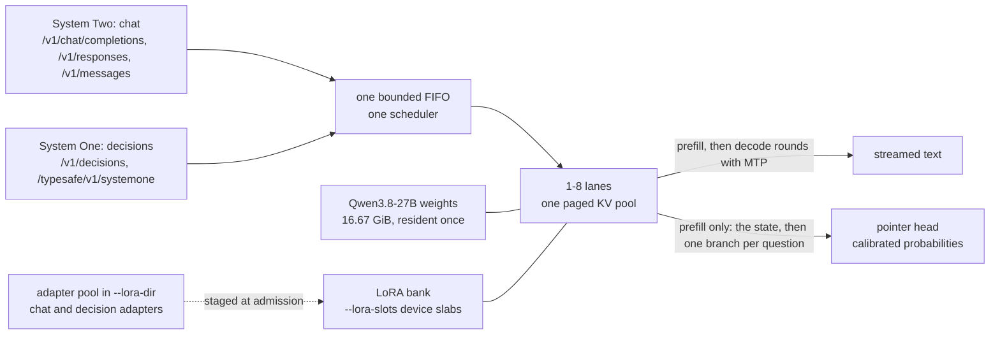

# NInfer-4090

> Apologies for the LLM text below, but this is still in heavy development, and I haven't gotten around to writing a proper README yet. In the meantime, though, here's something a LLM slapped together which is at least better than nothing.
> Also screenshots need to be updated as they are outdated.

NInfer-4090 serves **Qwen3.8-27B** on one 24 GB NVIDIA GeForce RTX 4090 as two systems in one
process. **System One** answers OpenAI Decisions and TypeSafe's classification API: a decision
reads a state and its questions by prefill alone and returns calibrated probabilities, in about
100 ms once the state is cached, without generating a token. **System Two** is chat: OpenAI- and
Anthropic-compatible generation with MTP speculative decoding. Both run on one resident copy of the weights, one
scheduler and one paged KV pool, and requests select LoRA adapters by model name — generative
adapters for chat, decision adapters for System One — from a pool that costs no VRAM and swaps into
a small device bank per request. [One model, two systems](#one-model-two-systems)

The engine is an `sm_89` port of [NInfer-3090](https://github.com/Don-Chad/ninfer-3090), which
derives from [Neroued/ninfer](https://github.com/Neroued/ninfer), a specialized C++20/CUDA inference
engine written from scratch — no PyTorch, no TensorRT, no llama.cpp. It loads the official
groupwise `.ninfer` artifact and brings paged KV, compatible-prefix reuse, CUDA Graphs, MTP
speculative decoding, reasoning-effort control, and ReplaySSM state transactions for the model's
Gated DeltaNet layers.

This fork targets `sm_89` and Linux. Blackwell-only NVFP4/W4A4 execution is unavailable; the
engine uses the same groupwise-int path as the 3090 base.

## One model, two systems

TypeSafe names its classification API after System One, the fast and automatic mode of
dual-process psychology; open-ended generation is the slow, deliberate System Two. In NInfer both
are ordinary requests to one engine: they wait in the same bounded FIFO, run on the same lanes over
the same KV pool, and reuse state through the same continuation cache, so a decision's state is
kept and restored the way a conversation's prefix is.



| | System One: decisions | System Two: chat |
|---|---|---|
| API | `POST /v1/decisions` (OpenAI Python SDK ≥3.26.0) or `POST /typesafe/v1/systemone` (TypeSafe SDK 0.6 and 0.7 unchanged) | OpenAI Chat Completions and Responses, Anthropic Messages |
| `model` selects | a decision adapter by pool name; TypeSafe alone also accepts `jev-latest` | the base weights or a generative adapter |
| GPU work | prefill only: the state once, then one branch per question continuing it | prefill, then decode rounds that draft and verify with MTP |
| Returns | an answer and calibrated option probabilities per question | streamed text, reasoning, and tool calls |
| Sampling | none: the same state and questions return the same probabilities | greedy or sampled |
| Measured | 101 ms for six questions on a retained 8K-token state, 3.98 s with the state cold | 104-128 tok/s per stream, two streams at once |
| KV codec | `bf16`, qualified to kev's fidelity bars; `int8` meets them too | any; `rk4v4` holds the full 262K context |

What the two systems share:

- **One copy of the weights.** The artifact's 16.67 GiB of device weights are resident once. A
  decision adapter is a LoRA adapter plus a pointer head, not a second model.
- **One adapter bank.** Every adapter in `--lora-dir`, generative or decision, is registered at
  startup, and the pool costs no VRAM. `--lora-slots` device slabs hold the adapters in use: a
  rank-16 slot is 80.5 MiB of LoRA weights plus a 5 MiB pointer-head region when the pool holds a
  decision adapter, 171 MiB for two slots. A request for an adapter no slot holds stages it in at
  admission, least recently used first, in about 47 ms, and a slot is never taken from a request
  still running on it.
- **Unchanged chat output.** A decision never samples and never joins a decode batch. Beside a
  closed loop of decisions, each chat stream's decode rounds kept their speed and MTP acceptance,
  and all 42 chat responses matched the same stream served alone byte for byte.

Run together on one card, the two systems share time, not speed. These existing measurements use
the TypeSafe surface, not a new OpenAI Decisions benchmark. Measured with decisions submitted
back to back (six questions on a retained 8,162-token state) beside two greedy chat streams, one on
the base weights and one on a chat adapter, with BF16 KV, MTP and two adapter slots:

| | Alone | Together |
|---|---:|---:|
| Decision latency, p50 | 100.9 ms | 100.9 ms |
| Decision end to end, with queueing, p50 | 116.3 ms | 125.8 ms |
| Decisions per second | 8.50 | 7.55 |
| Chat output rate, base weights | 104.1 tok/s | 21.6 tok/s |
| Chat output rate, chat adapter | 127.6 tok/s | 26.5 tok/s |
| Adapter swaps and slot waits | 0 | 0 |

The execution thread runs one unit at a time and alternates decode rounds with prefill units, and a
decision on a retained state is one 101 ms unit. Back to back, the decisions held about 76% of the
thread, so the chat streams kept their decode-round speed but got one round per decision. A lighter
decision load takes proportionally less from chat.
[Method, cold states and reading the rates](docs/performance.md#chat-and-system-one-together)

### Run it

Put a chat adapter and a decision adapter, both converted from PEFT with
`tools/convert/qwen3_8_27b/convert_lora.py` (`--decision-head` for the decision adapter), in one
directory, and start one server:

```bash
./build-sm89/apps/ninfer-serve models/qwen3_8_27b.ninfer --kv-dtype bf16 \
  --max-context 32768 --max-concurrency 4 --spec mtp --draft-tokens 3 --lm-head-draft \
  --lora-dir lora --lora-slots 2
```

System Two, through the chat adapter `lora/caveman7.lora.ninfer`:

```bash
curl -s http://127.0.0.1:8080/v1/chat/completions -H 'content-type: application/json' -d '{
  "model": "qwen3.8-27b-caveman7", "enable_thinking": false,
  "messages": [{"role": "user", "content": "Explain register renaming in two sentences."}]}'
```

```text
Hrrm. Register renaming copy each source register into free physical register before instruction
run, so write to same logical name no longer wait on read. That clear away false dependence, and
let machine run more instructions at once, matey.
```

System One, from the same process and weights, through the pool's decision adapter
`lora/systemone-decision-v7.lora.ninfer`, using OpenAI Decisions:

```python
from openai import OpenAI

client = OpenAI(api_key="local", base_url="http://127.0.0.1:8080/v1")
result = client.decisions.create(
    model="systemone-decision-v7",
    input="I was charged twice this month. Please refund one charge before Friday.",
    questions=[{
        "type": "predicate", "name": "billing",
        "instructions": "Is this message about billing?",
    }],
)
print(result.answers[0].probability)
```

Use OpenAI Python SDK **3.26.0 or newer**. `/v1/models` lists decision adapters by their actual
pool names with `supported_endpoints: ["/v1/decisions"]`, `modalities.vision: false`, and their
decision context limit. They cannot generate chat. There is no `gpt-6-luna` alias: this is
text-only wire compatibility, not Luna output, image, or refusal-policy parity.

Or use the unchanged TypeSafe surface:

```bash
curl -s http://127.0.0.1:8080/typesafe/v1/systemone -H 'content-type: application/json' -d '{
  "state": "I was charged twice this month. Please refund one charge before Friday.",
  "questions": {
    "billing": {"type": "noul", "instructions": "Is this message about billing?"},
    "tone": {"type": "choice", "instructions": "What is the tone?",
             "criteria": {"calm": null, "angry": null}},
    "urgency": {"type": "score", "instructions": "How urgent is it?",
                "criteria": ["Can wait", "Today"]}}}'
```

```json
{"model": "systemone-decision-v7",
 "answers": {"billing": {"type": "noul", "noul": 0.939},
             "tone": {"type": "choice", "choice": "calm", "confidence": 0.4149,
                      "probabilities": {"calm": 0.7075, "angry": 0.2925}},
             "urgency": {"type": "score", "score": 0.7477, "legend": {"0": "Can wait", "1": "Today"},
                         "probabilities": {"0": 0.2523, "1": 0.7477}, "confidence": 0.4953}},
 "usage": {"input_tokens": 58, "output_tokens": 150}, "latency_ms": 105.9}
```

The TypeSafe SDK needs only `base_url="http://127.0.0.1:8080/typesafe"`; `jev-latest` remains
exclusive to that surface. See [OpenAI Decisions](docs/serving.md#openai-decisions) and
[System One decisions](docs/serving.md#system-one-decisions) for schemas, SDK examples, usage,
strict OpenAI overflow rejection versus TypeSafe truncation, and errors. In the Docker image,
mount the adapter directory and pass the same flags after the
image name, as in the [quick start](#quick-start-linux) profiles.

### Limits

- **Qualified on BF16 KV.** Decisions meet kev's per-question tolerance on `bf16` KV, the
  configuration they are qualified on, and on `int8`. The rotated codecs, including the 262K
  `rk4v4` profile, keep task-level quality but miss the probability bar on a few questions
  ([System One fidelity](docs/serving.md#system-one-fidelity)).
- **Qwen3.8-27B only.** The Qwen3.6-35B-A3B target has no adapter pool and serves no System One
  model.
- **The pool is fixed at startup.** `--lora-dir` is read once, so adding or removing an adapter
  takes a restart; within the pool, adapters swap into the bank per request.
- **Decisions and chat share one execution thread.** While decisions arrive back to back, chat
  keeps about a fifth of its output rate. `--prefill-decode-balance` does not change that split,
  because a decision on a retained state completes within the unit that admits it.
- **Concurrent identical states are computed twice.** Two decisions on the same new state
  submitted together each prefill it; only a later decision reuses it.
- **Long states need L1 room.** A 65K-token BF16 state stays resident between decisions only with
  `--continuation-cache-l1-mib 8192`; at the default budget each repeat restores it from host
  memory in about 3 s ([decision latency](docs/performance.md#system-one-decision-latency)).

## Dashboard

The engine serves its own [dashboard](docs/dashboard.md) on the API port — no second process, no
exporter, no time-series database. It shows both systems: System One decisions with their latency
split and state reuse beside chat requests, which lanes run chat or decision work under which
adapter, the adapter bank's live residency, and prefill split between the two. A second view,
[`/playground`](docs/dashboard.md#playground), builds and runs System One requests against the same
server and shows each answer's distribution beside what the engine did for that decision. The
screenshots and recordings below predate both System One views.


**Steady state.** Three lanes, three requests queued at a 2.51 s mean wait. 60% of prompt tokens
never reach prefill, and 96% of that reuse is found already resident in VRAM, so time to first
token is dominated by prefill rather than by waiting. L3 is empty because nothing has had to spill
that far.


**Saturated.** Four lanes, eight requests queued at a 19.1 s mean wait, the board pinned at
`SW_POWER_CAP`, and L2 and L3 both flagged at capacity. Reuse still works — 71% of prompt tokens
avoid prefill — but none of it is resident any more: all 41 restores were imported from host or
disk, against 80 capacity evictions across the two tiers, and TTFT is now 87% queue. Nothing was
lost to it, though. Every evicted session was handed down a tier rather than dropped, which is the
distinction the churn panel exists to make.

Two recordings of the engine driving a live [OpenCode](https://opencode.ai) session, dashboard
beside it.

https://github.com/user-attachments/assets/623a6aca-c3ff-4664-8ae4-073bf7db1a2a

**[▶ Cold start](https://github.com/user-attachments/assets/623a6aca-c3ff-4664-8ae4-073bf7db1a2a)**
(35 s). An idle engine takes its first request with nothing to reuse, then decodes at 102 tok/s
behind a 5.12 s first token at 57% MTP acceptance. By the third request the cache panel already
reports the prompt arriving from a resident L1 lane rather than being prefilled again.

https://github.com/user-attachments/assets/916c7bda-7793-4474-ab4a-4eb90c3b02ff

**[▶ Continuation reuse](https://github.com/user-attachments/assets/916c7bda-7793-4474-ab4a-4eb90c3b02ff)**
(66 s). Successive turns of one session, each resuming the last instead of re-reading it. The
share of prompt tokens kept out of prefill climbs from 31% to 54% as the turns land, MTP
acceptance settles around 61%, and the queue never leaves zero — the engine is never the thing
being waited on.

## Highlights

The work specific to this branch, each with the measurement that established it:

- **One model, two systems.** One process answers text-only OpenAI Decisions under `/v1/decisions`
  and TypeSafe's System One protocol (`noul`, `choice` and `score` questions over one state) under
  `/typesafe` beside OpenAI- and Anthropic-compatible
  chat, on one resident copy of the weights, one KV pool and one LoRA bank. A decision adapter — a
  LoRA adapter plus a calibrated pointer head — answers six questions on a retained 8K-token state
  in 101 ms by prefill alone. It never samples or decodes, and reproduces kev's request rendering,
  token layout and answer arithmetic exactly, so the TypeSafe SDK works against it unchanged. Beside
  a closed loop of decisions, chat's decode rounds kept their speed and all 42 chat responses stayed
  byte-identical to the same streams served alone. [Details](#one-model-two-systems)
- **The full native 262,144-token (262K) context on 24 GB.** The rotated midrise 4-bit KV mode
  (`rk4v4`) is the shipping default and leaves 1.37 GiB of slack. A 5-needle retrieval probe at
  248K tokens returns all five codes, and vision fits alongside it. [Details](#the-tradeoff)
- **1.415x long-context prefill.** Every dense body GEMM now routes through INT8 tensor cores
  (`mma.m16n8k32.s32.s8.s8.s32`) during prefill: 1,701.4 → **2,409.2 tok/s** on a 115,125-token
  prompt. Decode is untouched — the INT8 activation catalog is admitted in prefill only, so
  committed decode numerics stay bit-identical to the previous build.
  [Details](#long-context-prefill)
- **Tiered continuation cache.** Complete Qwen state — paged KV, Gated DeltaNet recurrence, hidden
  state, turn checkpoints, MTP state — moves between retained GPU lanes, host RAM, and a
  restart-persistent content-addressed store. In one recorded agent session, 44 restores returned
  2.76 M cached tokens for about 2.9 s of synchronous work each, against an estimated 22-42 minutes
  to recompute them. [Details](docs/continuation-cache.md)
- **Prefix anchors that survive client-side history rewrites.** A lane holds two independent
  anchors: a rolling checkpoint that advances past completed tool results, and a user-turn anchor
  pinned upstream of the last user message's content. On a 46.7k-token session whose client moves a
  reminder block onto the newest user message every turn, reuse went from 0 to 46,552 tokens and
  TTFT from 16,654 ms to 587 ms. [Details](#prefix-reuse-and-anchors)
- **Agent-ready serving.** Hardened OpenAI Responses and Chat Completions surfaces, `/slots` with
  disk save/restore, `GET /metrics` under llama.cpp-compatible names, and a llama.cpp-compatible
  `timings` block so proxies read per-request prefill, decode, and draft-acceptance rates.
  [Details](#what-this-fork-changes)
- **Built-in web dashboard.** The Docker image builds it and serves it from the same port as the
  API, so `http://127.0.0.1:8080/` is a live view of the engine with nothing else to run. Two
  endpoints added for it — `GET /telemetry` for levels and `GET /events` for the record stream —
  drive aggregate and per-sequence throughput, decode batch size, lane occupancy and queue depth,
  the execution thread's wall-clock split, TTFT decomposition, continuation-cache fill against
  configured capacity, cache churn — whether reuse is drifting down the tiers and how much prefill
  recomputed state the cache demonstrably held — per-adapter usage, System One decisions with their
  queue, restore, state and branch latency split and their state reuse, each lane's system and
  adapter, the adapter bank's live residency and swaps, NVML board telemetry, and the VRAM budget.
  Every reading carries a tooltip explaining what it measures and what it means when it moves. The
  same page replays a `--request-log-jsonl` file offline, and says so where a panel is live-only
  rather than drawing zeros. [Guide](docs/dashboard.md)
- **Runtime LoRA adapters.** A directory of externally trained QLoRA adapters is served beside the
  base artifact and selected per request by model id, so one process exposes the base weights and
  every pooled adapter without reload. Chat adapters and System One decision adapters share the
  pool and the slots. Requests for the resident adapters mix in one decode batch; admission waits
  when all slots are pinned by other adapters. A resident but unselected bank costs nothing
  measurable in prefill; selecting one costs about 7-8%. Adapter identity is carried through prefix
  reuse, the continuation cache, and saved slot images, so cached state produced under one adapter
  can never be replayed under another. [Details](#runtime-lora-adapters)
- **Training-method agnostic.** NInfer consumes a standard PEFT LoRA directory whether an external
  producer fitted it with supervised or reinforcement learning. A measured rank-16 GRPO adapter
  moved held-out reward on unseen puzzles from 0.6029 to 0.8624, then converted, banked and served
  through exactly the same runtime path as an SFT adapter. Adapter training and its evaluation are
  owned by the separate `llm-datasets` repository. [Details](#runtime-lora-adapters)

## Measured results on the RTX 4090

Conditions: single request, greedy decoding, CUDA Graphs on, `--prefill-chunk 1024`, official
16.96 GiB Qwen3.8-27B artifact. Prefill rows come from the `ninfer-serve` structured request log
(computed prefill only); the decode rows use the `ninfer` CLI except the code-generation row, which
comes from `/metrics`.

| Test | KV mode | Result |
|---|---|---|
| Prefill at 118K depth | `rk4v4` | **2,577.9 tok/s** |
| Decode, code generation, MTP3 | `int8` | **148.6 tok/s** at 81.0% draft acceptance |
| Decode, bench corpus, MTP3 | `int8` | 106.5 tok/s at 48.7% acceptance |
| Decode, no speculation | `int8` | 50.5 tok/s |
| Decode at 128K depth, no speculation | `int8` | 39.6 tok/s |
| 64K needle-in-a-haystack | `int8` | exact answer, 1,849 tok/s prefill |
| 128K needle-in-a-haystack | `int8` | exact answer, 1,561 tok/s prefill |
| Vision, chart reading | `int8` | 3 of 3 oracle facts, 22 ms vision tower |
| Test suite | - | 91 of 91 ctest targets pass on `sm_89`; 5 gate on the real artifact or FP4 hardware |

MTP acceptance, and with it the decoded rate, tracks how predictable the output is: structured code
accepts about 81% of draft tokens, the mixed bench corpus about 49%.

The two needle rows were measured before the INT8 prefill routes landed and are the older BF16
prefill path. The decode rows are unaffected by that change: the INT8 activation catalog is gated
to `TextPhase::Prefill`, so decode and speculative verify keep the BF16 catalog and are
bit-identical to the previous build.

The shipping default has since moved from INT8 KV to the rotated midrise 4-bit KV mode (`rk4v4`),
which serves the model's full native 262,144-token context on this card. Against the INT8 numbers
above, its E8-lattice predecessor `rk4v4-e8` left MTP acceptance at depth unchanged and cost a 5.7%
decode tax and 1-2% of prefill; `rk4v4` decodes at that predecessor's rate and prefills 2.3%
faster. See [Quick start](#text-only-full-262144-token-native-context-4-bit-kv-default) for the
measured deltas.

For scale: llama.cpp on the same card decodes the Qwen3.8-27B `UD-Q4_K_XL` GGUF at about
46 tok/s in a 144K-context configuration where the MTP buffers do not fit. The upstream engine
on an RTX 5090 measures 172 tok/s on the same code-generation prompts with a 400 W power cap
(the upstream README quotes about 200), so this card lands within 14% of it under MTP.

### Long-context prefill

INT8 tensor-core routes replaced the BF16 routes on all six dense body GEMM Ops, in three stages.
Measured on a 115,125-token prompt with `rk4v4-e8` KV, `--prefill-chunk 1024`, the continuation
cache off, and prefix reuse disabled, reading `prefill_tok_s` from the structured request log:

| Configuration | Prefill | Cumulative |
|---|---:|---:|
| BF16 routes | 1,701.4 tok/s | 1.000x |
| INT8 `linear_swiglu` (Q4) | 1,976.4 tok/s | 1.162x |
| INT8 `linear_add` (Q5) | 2,147.3 tok/s | 1.262x |
| INT8 `attn_input_proj` + `gdn_input_proj` | **2,409.2 tok/s** | **1.415x** |

`--prefill-chunk 2048` adds a further 0.6% (2,423.2 tok/s); 4096 does not improve on it. Repeat
measurements of one configuration reproduce to within 0.12%.

That ladder used the E8-lattice `rk4v4-e8` KV mode, since replaced by the midrise `rk4v4`. On the
probe's current 118,242-token prompt, measured back to back at a 2,715 MHz SM clock, the last
`rk4v4-e8` build prefills at 2,520.6 tok/s and the `rk4v4` build at **2,577.9 tok/s** (+2.3%).

The routes are registered over every prefill token count, which keeps a token's projection output
independent of the width of the call that produced it — the property prefix reuse depends on. The
cost is that short prompts also take INT8, where the tuned small-`T` BF16 routes were faster:

| Prompt tokens | BF16 projections | INT8 projections |
|---:|---:|---:|
| 99 | 185.5 tok/s | 177.3 tok/s |
| 229 | 447.2 tok/s | 434.1 tok/s |
| 770 | 1,311.4 tok/s | 1,334.5 tok/s |
| 2,827 | 2,316.0 tok/s | 2,535.7 tok/s |
| 8,105 | 2,760.0 tok/s | 3,186.5 tok/s |

Break-even is near 770 tokens; the worst case is about 15 ms on a 229-token prompt.

Method, per-kernel budgets, and the accuracy screening are in
[Performance](docs/performance.md#rtx-4090-sm_89-long-context-prefill).

### Depth sweep against llama.cpp

> The NInfer prefill column below was measured on 2026-08-17, before the INT8 prefill routes.
> Prefill has since improved 1.415x at 115K depth, so these rows understate the current build. The
> two engines have not been re-measured at matched depth on the same day, so no prefill lead is
> claimed here. The decode rows are current.

Both engines were measured on the same card. llama.cpp build 10358 ran `llama bench` on the
`UD-Q4_K_XL` GGUF (16.68 GiB) with q8_0 KV cache, flash attention, and `-ub 1024 -b 4096`,
which matches its deployed configuration, on 2026-08-15. The NInfer side was measured on
2026-08-17 on the deployed E8 262K configuration through the `/metrics` counters; the
llama.cpp configuration did not change between the dates. Two caveats: the artifacts differ
by about 2% in size, and `llama bench` is a bare kernel loop while the NInfer numbers
include the full server path.

Marginal rates at depth. Depth labels in this section are binary — `32K` is 32,768 tokens and
`256K` is the full 262,144-token context:

| Depth | llama.cpp pp2048 | llama.cpp tg32 | NInfer decode, no speculation |
|---:|---:|---:|---:|
| 0 | 3,024 tok/s | 45.9 tok/s | 50.4 tok/s |
| 32K | 2,327 | 42.0 | - |
| 64K | 1,866 | 38.6 | - |
| 128K | 1,336 | 33.1 | 42.1 |
| 256K | no entry | no entry | 36.6 |

Wall time to prefill one full prompt (llama.cpp integrated from the marginal rates, NInfer
measured on the pre-INT8 build):

| Prompt | llama.cpp | NInfer (pre-INT8) |
|---:|---:|---:|
| 32K | 12.5 s (2,630 tok/s) | 14.5 s (2,027 tok/s) |
| 64K | 28.3 s (2,317 tok/s) | 31.7 s (1,857 tok/s) |
| 128K | 70.4 s (1,862 tok/s) | 74.5 s (1,581 tok/s) |
| 192K | no entry | 127.9 s (1,381 tok/s) |
| 256K | no entry | 191.7 s (1,228 tok/s) |

Everything past llama.cpp's 144K ceiling is NInfer-only. Decode inverts the shallow picture:
NInfer leads by 10% shallow and by 27% at 128K without speculation, and the MTP3 gap grows with
depth:

| Workload | llama.cpp `draft-mtp` | NInfer MTP3 (E8) |
|---|---:|---:|
| Code, shallow | 118.8 tok/s at 85.9% acceptance | 142.9 tok/s at 78.0% |
| Prose, 64K depth | 55.5 tok/s at 45.3% | 86.1 tok/s at 42.3% |
| Prose, 128K depth | 42.3 tok/s at 45.4% | 77.5 tok/s at 41.6% |
| Prose, 256K depth | no entry | 65.4 tok/s at 41.1% |
| Code, 256K depth | no entry | 91.2 tok/s at 72.1% |

The NInfer rows in this table use the 2026-08-17 generated corpora; acceptance on them runs
a few points below the 2026-08-15 payloads (code 78% against 81%), which accounts for the
difference from the headline 148.6 tok/s. The llama.cpp MTP rows required a reduced
131,584-token context; the draft buffers push VRAM to 23.8 of 24 GiB, and the deployed 144K
llama.cpp configuration cannot fit them at all. NInfer serves 172,032 tokens with MTP in the same
VRAM at INT8 KV, and the full native 262,144 with the 4-bit `rk4v4` KV default. Acceptance matches per
content type, so the decode gap is engine time, not draft quality.

Full configurations, method, and raw numbers:
[NInfer against llama.cpp](docs/llamacpp-comparison.md).

## Quick start (Linux)

Requirements: an RTX 4090, a recent NVIDIA driver, Docker with the NVIDIA Container Toolkit.

Build the image. The build uses `models/qwen3_8_27b.ninfer` when it is present and has the
published SHA-256; otherwise it downloads and verifies the artifact from Hugging Face. The model
is embedded in the resulting image.

```bash
docker build --tag ninfer-4090:sm89 .
```

Then start one of the three profiles. The API is available at `http://127.0.0.1:8080/v1`, and the
[web dashboard](docs/dashboard.md) at `http://127.0.0.1:8080/` — the image builds it and every
profile below serves it, so no separate process or port is involved.

The profiles as written run one generation slot. `--max-concurrency 2` is measured
and worthwhile on the 4090: the second lane costs about 390 MiB (state pools plus a
doubled CUDA-graph allowance) while the KV page pool stays shared, so a lone session
still uses the full context; single-stream decode is unregressed and two sessions
decode batched at roughly 1.5x aggregate throughput, each lane keeping its own
resident prefix. Prefill still serializes across lanes, so a deep cold prefill
delays the other lane's first token.

Add `--turn-checkpoints 32` when clients edit conversation history (agent memory
updates, message rewrites, regenerated turns): the server then re-prefills from
the nearest retained turn boundary instead of from zero. The ring costs host
memory only, about 4.6 GiB per slot at 32 entries. See
[docs/turn-checkpoint-ring.md](docs/turn-checkpoint-ring.md).

Extra requests beyond the slots wait in the admission queue, and the queue deadline
defaults to 30 seconds. A deep prefill can hold a slot longer than that, so
parallel agent clients would fail with `request_queue_timeout`. The
`--pending-timeout-ms 600000` line raises the deadline to 10 minutes. On a
streaming request the timeout arrives as an in-band SSE error event after HTTP 200;
a client that does not parse error events sees a stream that ends without a
`finish_reason`. See [docs/serving.md](docs/serving.md) for the full queue
contract.

### Text-only, full 262,144-token native context (4-bit KV, default)

The rotated 4-bit KV mode (`rk4v4`: Hadamard-rotated keys and values in one midrise 4-bit codec;
the rotated modes were ported from
[UDPSendToFailed/ninfer-4090](https://github.com/UDPSendToFailed/ninfer-4090), see
[the fork comparison](docs/udp-fork-comparison.md)) fits the model's entire native
262,144-token context on 24 GB with 1.37 GiB to spare:

```bash
docker run --rm --gpus all --publish 8080:8080 \
  --volume ninfer-continuations:/var/cache/ninfer \
  ninfer-4090:sm89
```

The named volume preserves continuation state across container replacement. The image starts with
`l1-l2-l3`, a 768 MiB retained-VRAM budget, 16 GiB host budget, 48 GiB disk budget, 4 GiB free-space
reserve, and the `local` namespace below `/var/cache/ninfer`. Omit the volume only when an anonymous,
container-managed cache is acceptable. The cache accelerates exact compatible prefixes; it is not a
response/result cache.

The image's default command is equivalent to:

```bash
ninfer-serve /opt/ninfer/models/qwen3_8_27b.ninfer \
  --model-id qwen3.8-27b \
  --host 0.0.0.0 --port 8080 \
  --max-context 262144 --kv-capacity 262144 \
  --max-concurrency 1 --max-pending-requests 16 \
  --pending-timeout-ms 600000 \
  --prefill-chunk 1024 --kv-dtype rk4v4 \
  --spec mtp --draft-tokens 3 --lm-head-draft \
  --prefix-checkpoint-policy rolling-tool \
  --continuation-cache l1-l2-l3 \
  --continuation-cache-dir /var/cache/ninfer \
  --continuation-cache-namespace local \
  --continuation-cache-l1-mib 768 \
  --continuation-cache-l2-mib 16384 \
  --continuation-cache-l3-mib 49152 \
  --continuation-cache-filesystem-reserve-mib 4096 \
  --preserve-thinking
```

Measured against INT8 KV with the E8-lattice predecessor `rk4v4-e8`: identical MTP acceptance at
111K depth (78.8% vs 78.4%), a 5.7% decode tax (126.6 vs 134.2 tok/s on a shallow greedy code
probe), prefill within 1-2% at matched depth, and exact single-needle, 5-needle, and code-detail
retrieval through 260K tokens. Against that predecessor, `rk4v4` decodes at the same rate at 114K
depth (42.7 vs 42.6 tok/s without speculation), prefills 2.3% faster, and returns all five codes of
a 5-needle probe at 248K tokens.

### Text-only, 172,032-token context (INT8 KV, maximum precision)

```bash
docker run --rm --gpus all --publish 8080:8080 \
  --volume ninfer-continuations:/var/cache/ninfer \
  ninfer-4090:sm89 \
  ninfer-serve /opt/ninfer/models/qwen3_8_27b.ninfer \
  --host 0.0.0.0 --port 8080 \
  --max-context 172032 --kv-capacity 172032 \
  --max-concurrency 1 --max-pending-requests 16 \
  --pending-timeout-ms 600000 \
  --prefill-chunk 1024 --kv-dtype int8 \
  --spec mtp --draft-tokens 3 --lm-head-draft \
  --continuation-cache l1-l2-l3 \
  --continuation-cache-dir /var/cache/ninfer \
  --continuation-cache-filesystem-reserve-mib 4096 \
  --preserve-thinking
```

### With vision, full 262,144-token context (4-bit KV)

The vision scratchpad defaults to 8192 tokens (`--vision-max-tokens`, ported from
the same fork as the rotated KV modes) instead of the former hardcoded 32768. The
smaller scratchpad frees about 1.5 GiB, so the full native context fits next to
vision on 4-bit keys:

```bash
docker run --rm --gpus all --publish 8080:8080 \
  --volume ninfer-continuations:/var/cache/ninfer \
  ninfer-4090:sm89 \
  ninfer-serve /opt/ninfer/models/qwen3_8_27b.ninfer \
  --host 0.0.0.0 --port 8080 \
  --max-context 262144 --kv-capacity 262144 \
  --max-concurrency 1 --max-pending-requests 16 \
  --pending-timeout-ms 600000 \
  --prefill-chunk 1024 --kv-dtype rk4v4 \
  --spec mtp --draft-tokens 3 --lm-head-draft \
  --continuation-cache l1-l2-l3 \
  --continuation-cache-dir /var/cache/ninfer \
  --continuation-cache-filesystem-reserve-mib 4096 \
  --vision --preserve-thinking
```

The scratchpad bounds the image tokens per request, not the conversation depth:
a 51K-token conversation with an attached image completes normally. One
1024x1024 image costs 1026 vision tokens, so the default fits about seven
maximum-size images per request. The server rejects a request over the limit
with `media_budget_exceeded` before the request reaches the encoder. For dense
video workloads, raise the limit with `--vision-max-tokens`. Each additional
1024 tokens of scratchpad costs about 62 MiB of VRAM.

### The tradeoff

KV precision, vision, and maximum context trade against each other on a 24 GB card:

| Profile | KV mode | Context | KV runtime | Startup slack |
|---|---|---:|---:|---:|
| Text-only, MTP3 | `rk4v4` | 262,144 | 5.08 GiB | 1.37 GiB |
| Text-only, MTP3 | `rk2v4-e8` | 262,144 | 4.01 GiB | 2.43 GiB |
| Text-only, MTP3 | `int8` | 172,032 | 6.31 GiB | 136 MiB |
| With `--vision`, MTP3 | `rk4v4` | 262,144 | 5.41 GiB | 780 MiB |
| With `--vision` (32K scratchpad), MTP3 | `rk2v4-e8` | 262,144 | 5.85 GiB | 329 MiB |
| With `--vision` (32K scratchpad), MTP3 | `rk4v4` | 212,992 | 6.06 GiB | 108 MiB |
| With `--vision` (32K scratchpad), MTP3 | `int8` | 98,304 | - | ~1 GiB |

262,144 is the model's own context limit, so `rk2v4-e8` (2-bit keys, 96.2% cosine)
buys no additional context over `rk4v4` in the text-only profile - only slack.
That slack is what pays for vision. With the former hardcoded 32,768-token vision
scratchpad, vision cost about 2.1 GiB (1.83 GiB of runtime buffers plus a
0.28 GiB tower): INT8 could only afford it at 98,304, 4-bit keys topped out at
212,992, and only 2-bit keys fit the full 262,144. The default 8192-token
scratchpad cuts the cost to about 0.6 GiB, and the full native 262,144 now fits
alongside vision on 4-bit keys with 780 MiB of slack. The vision
modes answer a two-swatch color oracle exactly at temperature 0, including with
the image buried under 52,700 tokens of text on `rk2v4-e8`. `rk2v4-e8` also passes
the text retrieval gates (single-needle at 260K, 5-needle at 118K, exact code
details at 168K) at a 10% decode tax (120.5 tok/s on the shallow code probe). The
INT8 text-only ceiling is near 176K: 172,032 starts, and 196,608 is rejected at
startup with a byte-exact deficit. The server validates memory before it listens,
so an oversized context fails fast instead of at request time.

### Native build

For a native build, follow the [Linux build guide](docs/rtx-3090-linux.md) with
`CMAKE_CUDA_ARCHITECTURES=89` (the only value this fork accepts). The build requires CUDA 12.8 or
newer, GCC 13, and CMake 3.28 or newer; the Docker image builds with CUDA 13.2.

The repository ships a `Makefile` wrapper for the common cycle, which configures into `build-sm89`
with Ninja and a bounded compile pool for the template-heavy CUDA translation units:

```bash
make configure      # cmake -S . -B build-sm89 -G Ninja ...
make build          # or plain `make`
make test           # build, then ctest
```

Override `BUILD_DIR`, `JOBS`, `BUILD_TESTING`, `BUILD_BENCHMARKS`, or the target-package switches on
the command line, or persist them in an untracked `Makefile.local`.

The default build registers only Qwen3.8-27B. Enable the optional Qwen3.6-35B-A3B package with
`-DNINFER_BUILD_QWEN3_6_35B_A3B=ON`, or with
`BUILD_QWEN3_6_35B_A3B=ON make configure`. A 35B-only build additionally sets
`NINFER_BUILD_QWEN3_8_27B=OFF`. At least one target package must be enabled.

## What this fork changes

### Execution and performance

- **`sm_89` retarget.** The CMake architecture pin, the runtime compute-capability check, and the
  NVFP4 stub gate now select `sm_89`. Most SM86 kernel schedules run unmodified on Ada; the
  INT8 attention prefill schedule is retuned (below).
- **INT8 tensor-core prefill routes.** Every dense body GEMM of `qwen3.8-27b/groupwise-int` —
  `linear_swiglu` (Q4), `linear_add` (Q5 at k=6144 and k=17408), and the fused `attn_input_proj`
  and `gdn_input_proj` pairs — routes through `mma.m16n8k32.s32.s8.s8.s32` during prefill, on a
  shared group-64 symmetric INT8 activation quantization. 1,701.4 → 2,409.2 tok/s at 115K depth
  (1.415x); see [Long-context prefill](#long-context-prefill). Three properties bound it:
  admission is gated to `TextPhase::Prefill`, so committed decode numerics and CUDA Graph capture
  are unchanged; each catalog is registered as one route over every token count, so a token's
  output never depends on the width of the call; and quantized activations stage in caller-owned
  arenas tiled at 4,096 tokens, so transient capacity is independent of context length. The
  activation quantization is a declared semantic boundary with its own FP64-oracle criterion, not
  a bit-exact transform — measured relative Frobenius error 1.59e-02 against 2.97e-03 for BF16 on
  identical shapes. Consequences are recorded under [Known limits](#known-limits-on-the-rtx-4090).
- **Ada-retuned INT8 attention prefill.** The SM120 schedule spills registers on Ada and pays the
  consumer half-rate penalty for f32-accumulate HMMA. Arch-gated for `sm_89`: the full
  128-register budget, eight paired producer warps over `Bc` column halves with one named-barrier
  exchange per key tile, byte-permute V dequantization (bit-identical), and fp16-accumulated PV
  tiles folded into the fp32 running accumulator each tile. The kernel gains 30% at 64K depth
  (109 to 143 TFLOP/s on the `d256-h24-kv4` INT8 append shape); serve prefill gains 5-7% at
  88K-128K. Needle-in-a-haystack retrieval stays exact at both depths and all suite tests
  pass, which bounds the fp16-accumulation numerics change.
- **Causal-tile partitioned key-block traversal.** Interior key blocks (wholly below the causal
  diagonal for the whole CTA tile) run a separate instantiation of the key-block body: KV stages
  with unconditional copies and the softmax drops its masking selects; boundary blocks keep the
  exact masked path. The idea comes from the
  [UDPSendToFailed fork](https://github.com/UDPSendToFailed/ninfer-4090) (c5f70526),
  re-implemented inside the retuned schedule above. Kernel: 144 to 165 TFLOP/s at 32K-224K
  context on the INT8 append shape (-12 to -13% latency), register count unchanged, bit-exact.
  End-to-end this is bounded by the attention wall share of this hybrid-GDN model: about +1%
  serve prefill at 51K on INT8 KV, within noise on the E8 modes, whose staging time is dominated
  by lattice decode rather than the removed guards.
- **Rotated KV quantization (ported, then reworked).** The rotated KV modes (`rk8v4`, `rk4v4`,
  `rk2v4-e8`) and the 262K-to-1M visible-keys envelope lift from the
  [UDPSendToFailed/ninfer-4090](https://github.com/UDPSendToFailed/ninfer-4090) sibling fork,
  merged under this fork's retuned `sm_89` attention prefill schedule. Every packed 4-bit plane now
  uses one midrise codec, sixteen odd multiples of a half-step group scale, which replaced both
  the ported symmetric 4-bit codec and the E8-lattice 4-bit key mode `rk4v4-e8`. The 2-bit E8 root
  key codec of `rk2v4-e8` verifies bit-exactly against the upstream microbenchmark (96.155%
  cosine); their 1 GiB CUDA-graph allowance bump was deliberately not taken (it would evict the
  INT8 168K profile). Port method and measurements in
  [docs/udp-fork-comparison.md](docs/udp-fork-comparison.md).

### Long-context state reuse

- **Tiered continuation cache.** Complete Qwen state — paged Text and MTP KV, Gated DeltaNet
  recurrent state, continuation hidden state, and turn checkpoints — can move from retained GPU
  lanes (L1) to byte-bounded host images (L2) and a restart-persistent, content-addressed local
  store (L3), with independent per-tier TTLs, quotas, a filesystem reserve, and atomic
  publication. `prompt_cache_key` routes session heads, automatic exact stable-prefix aliases
  share fixed system/tool prefixes, cold builders coalesce, and publication is asynchronous so it
  never blocks hot L1 reuse. Every restore is gated by complete artifact SHA-256, runtime layout,
  canonical token/position/media identity, and an exact prefix preflight. See
  [Tiered continuation cache](docs/continuation-cache.md).
- **Configurable rolling tool checkpoints.** `--prefix-checkpoint-policy rolling-tool` (the new
  default) advances the turn checkpoint to the latest generation opener after completed tool-call
  results, so a serial tool loop recomputes only its newest suffix. `stable-turn` retains the
  previous behavior — the first assistant opener after the last real user query. Both remain
  subject to exact prepared-prefix identity.
- **User-turn prefix anchor.** A lane now carries a second, independent anchor pinned at the
  opener of the last real user query, upstream of that message's content. Clients that rewrite the
  tail of the newest user message — opencode's `SessionReminders.apply` appends an unpersisted
  `<system-reminder>` block there, moving roughly 360 tokens every turn — invalidate the turn
  checkpoint along with the execution frontier and otherwise fall back to the bare system+tools
  prefix. Measured on a 113k-token session, the first request of every turn reused only 13,127
  tokens and spent about 50 s in prefill. The planner now orders three candidates by depth
  (frontier, turn checkpoint, user turn) and reports the selection as `restore_user_turn_anchor`.
  The anchor is captured once per turn through the existing chunk-landing mechanism, held in host
  memory rather than a third device slot (which would have cost 147 MiB per lane), and is
  lane-local — continuation images carry none, and `import_continuation_lane` and `clear_lane`
  clear it, so a restored image cannot splice another conversation's recurrent state into the
  lane. On a 46.7k-token session reproducing the rewrite: reuse 0 → 46,552 tokens against a
  ceiling of 46,562, TTFT 16,654 ms → 587 ms.
- **Slot session save/restore.** `--slot-save-path DIR` (off by default) enables llama.cpp-style
  `POST /slots/{id}?action=save|restore|erase`: one idle slot's complete resident session -
  paged Text and MTP KV, GDN linear-attention state, turn checkpoint, and prefix identity -
  moves to or from disk, and a restored slot reuses the cache across server restarts instead of
  re-prefilling (a 6.9k-token session restores in about 0.1 s against a multi-second reprefill).
  Sessions are identified by a stable `session_digest`; chat completions carry `id_slot` and the
  digest next to `timings`, and `save`/`erase` accept an `if_digest` precondition checked
  atomically, so a client always persists exactly the session it means. Restore extends the
  saved frontier (or its turn checkpoint); the GDN state cannot rewind further, and the DFlash
  backend is not supported. Details in [docs/serving.md](docs/serving.md).
- **Reuse-aware lane choice.** When prefix reuse ties (typically zero for a fresh session),
  admission picks the lane whose occupation costs least to replace - an empty lane before any
  retained session, then the shallowest - so a burst request no longer evicts a deep resident
  session while a free lane exists.
- **Turn checkpoint ring.** `--turn-checkpoints N` (off by default) keeps up to N past turn
  checkpoints per slot in host memory. A prompt that rewrites the middle of its history -
  an edited message, an updated agent memory block, a regenerated earlier turn - restores at
  the deepest checkpoint below the edit instead of re-prefilling from zero. The ring and the
  user-turn anchor are independent rewind points: ring entries land wherever the checkpoint
  policy placed a checkpoint, always after the last user message's content, while the anchor
  sits at that message's opener. The planner takes whichever is deepest and still matches.
  One checkpoint holds the GDN linear-attention state (about 147 MiB of host memory on
  Qwen3.8-27B); the attention KV needs no copy. Slot snapshots carry the ring across restarts.
  The recommended value is 32. Details in
  [docs/turn-checkpoint-ring.md](docs/turn-checkpoint-ring.md).
- **Auto-save on eviction.** `--auto-save-evicted` (off by default, requires
  `--slot-save-path`) spills an involuntarily evicted session - checkpoint ring included -
  back to the slot file it was last saved to or restored from, before the eviction destroys
  it. Rotating more sessions than slots then loses nothing: the next restore recovers the
  session at its latest frontier. Explicit `erase` never auto-saves.

### Serving surface

- **Hardened OpenAI Responses and Chat Completions.** Public reasoning is exposed through native
  `summary_text` Items and semantic Responses SSE events; stored `item_reference` inputs resolve
  exactly with atomic lookup, LRU cleanup, and bounded index accounting; reconstructed
  continuations preserve natural Engine prefix reuse and report exact cached input tokens;
  `prompt_cache_key` is accepted as an SDK routing hint with `cache_write_tokens` reported as
  zero; persistence is the streaming success point, so a cancelled request is not stored; and
  unsupported capabilities — non-viable tool choices, strict tools, nonempty `logit_bias`, unknown
  fields — fail explicitly instead of being silently accepted. Cancellation is represented as
  `response.failed` with `request_cancelled`.
- **`/v1/models` reports `context_window`.** Clients without access to a llama.cpp `/props` or a
  vLLM `max_model_len` can size prompts from the models payload.
- **llama.cpp-compatible `timings` on chat completions.** Responses and final stream chunks carry
  a top-level `timings` block (`prompt_n`/`predicted_n`, per-second rates, `ttft_ms`, `cache_n`,
  `draft_n`/`draft_n_accepted`), so proxies such as llama-swap show per-request prefill and decode
  rates, MTP draft acceptance, and prefix-cache hits. Contributed by the
  [shantanusingh16 fork](https://github.com/shantanusingh16/ninfer-4090) of this repository.
- **`GET /metrics`.** Prometheus counters under llama.cpp-compatible names
  (`llamacpp:prompt_tokens_total`, `llamacpp:prompt_seconds_total`,
  `llamacpp:tokens_predicted_total`, `llamacpp:tokens_predicted_seconds_total`,
  `llamacpp:requests_processing`, `llamacpp:requests_deferred`), so existing scrapers read this
  server without changes. Prompt tokens count only computed prefill; prefix-cache hits are
  excluded, as in llama.cpp. Additional `ninfer:` series report request totals, prefix-cache
  hits, MTP draft/acceptance totals, and continuation-cache lookup, restore, persistence, L1, L2,
  and L3 occupancy/activity.
- **`GET /slots`.** A llama.cpp-shaped slot table read from the engine's real lane state: busy
  slots report their request's prompt and reused-prefix sizes, idle retained slots report the
  resident session's depth and its identifying `session_digest`. Truthful per-slot attribution
  holds at any `--max-concurrency`.
- **`GET /telemetry` and `GET /events`.** One live JSON snapshot carrying what `/metrics` cannot
  express — NVML board sensors and decoded clock-throttle reasons, the scheduler's own
  running/prefilling/decode-ready/waiting occupancy, the execution thread's wall-clock split with
  its admission decomposition, the `MemorySummary` VRAM budget including the resident LoRA bank,
  cache occupancy paired with the configured tier capacities and per-tier capacity evictions, each
  lane's work (chat or System One) and adapter, the adapter pool with the bank's live residency and
  swap counts, and the System One binding — plus an SSE stream of the same schema-23 records
  `--request-log-jsonl` appends. Records are formatted once and fanned out to both sinks, so a
  live reader and a file reader see identical lines. The engine readings come from the snapshot
  the execution thread publishes at every unit boundary, so the endpoint answers in milliseconds
  under full load. These back the [web dashboard](docs/dashboard.md).
- **Configurable vision scratchpad (ported).** `--vision-max-tokens` comes from the
  [UDPSendToFailed fork](https://github.com/UDPSendToFailed/ninfer-4090) and sizes the vision
  encode workspace (default 8192 tokens, formerly hardcoded 32768). This fork additionally wires
  the processor media budget to the same limit, so an over-limit request fails as
  `media_budget_exceeded` instead of reaching an undersized encoder.
- **Vision modality in `/v1/models`.** The models payload reports whether the running server was
  started with `--vision`.

### Runtime LoRA adapters

Externally trained QLoRA adapters are converted to `.ninfer` and discovered from a directory at
startup. There is no weight merging and no reload: the base artifact stays resident and each request
selects an adapter by name.

```bash
ninfer-serve models/qwen3_8_27b.ninfer --lora-dir lora --lora-slots 4
```

Every `*.ninfer` in `lora/` becomes a servable model named after its file, so `math.lora.ninfer` and
`pirate.lora.ninfer` expose `qwen3.8-27b`, `qwen3.8-27b-math` and `qwen3.8-27b-pirate` on
`/v1/models`. Any mix can be queued together; base requests and adapters occupying the resident
slots can be in flight at once, and the engine forms one compact decode batch across that mix. The
same pool options are available in the CLI, where `--adapter NAME` selects one adapter.

- **Unbounded pool, bounded slots.** The number of servable adapters is limited only by disk — the
  pool costs no VRAM. `--lora-slots` (default 2) sets how many are device-resident, and an adapter
  the pool has but the slots do not is swapped in at admission, least-recently-used first, in about
  47 ms without a fingerprint sidecar cache. A slot is never taken from a request that is still
  generating against it; admission waits
  instead. Setting `--lora-slots` to `--max-concurrency` removes waiting entirely.
- **Mixed adapters in one bank.** Adapters with different ranks and different site sets coexist:
  the bank executes the union of the directory's sites at its highest rank and zero-pads the rest,
  which is numerically exact. The cost is that a narrow adapter pays the widest adapter's launch
  count — worth about 1.2-1.6% of prefill for the GDN site.
- **Seven registered sites.** Query, output-gate, key, value and attention output on the 16
  full-attention layers; the Gated DeltaNet output projection on the other 48; and the MLP down
  projection on all 64. At `r=16` that is 42,205,184 parameters and 84.4 MB per adapter. `gate_proj`,
  `up_proj` and the GDN input projections are structurally excluded — their deltas would have to
  land inside `silu(g) * u` and inside the fused causal convolution, which no post-hoc additive pass
  can express.
- **Adapter-scoped state.** KV and Gated DeltaNet state produced under one adapter is numerically
  invalid under another, so identity is enforced in three places: a resident lane records the
  adapter that produced it and refuses cross-adapter prefix reuse, every continuation-cache alias is
  namespaced by adapter, and a saved slot image records the SHA-256 of the adapter artifact that
  produced it. Content identity rather than a pool position is what makes a saved session survive
  adapters being added to or removed from the directory; one that no longer resolves is refused
  rather than replayed against a neighbour. Reusing one `prompt_cache_key` across adapters is a safe
  miss.
- **Decision adapters in the same bank.** A System One decision adapter is a LoRA adapter plus a
  pointer head, converted with `convert_lora.py --decision-head`. It is pooled, staged and evicted
  like a generative adapter; when the pool holds one, every slot reserves a 5 MiB region for a head.
  Its pool name answers under `/v1/decisions` and `/typesafe`; generative adapters and the base
  model answer only through the generation APIs. See [One model, two systems](#one-model-two-systems).
- **Measured cost.** With one adapter selected, prefill runs at 3,307 tok/s on a 9,411-token prompt
  and 3,017 tok/s on 37,798, against 3,601 and 3,247 for a base request in the same process — about
  8.2% and 7.1%. A resident bank costs base requests nothing measurable. The cost is activation
  traffic in a skinny rank-16 GEMM, not arithmetic: the added FLOPs are under 1% of the adapted
  projections.
- **Speculative decoding interacts.** The MTP draft head is not adapted, by design, while the target
  verify pass is, so every token where the adapter flips the argmax is drafted from base weights and
  rejected. Measured acceptance falls from 88.0% to 66.0%. DFlash and LoRA are mutually exclusive.
- **External training, one runtime contract.** NInfer accepts the standard PEFT handoff regardless
  of whether it was produced by SFT or GRPO. Training drivers, target profiles, corpora,
  calibration and `training_report.json` belong to the separate `llm-datasets` repository; its
  Qwen3.8-27B contract is `llm-datasets/docs/targets/qwen3_8_27b.md`.
- **Conversion tooling included.** `tools/convert/qwen3_8_27b/convert_lora.py` validates the PEFT
  handoff, hard-rejects unsupported modules, de-interleaves the fused query/gate projection, folds
  `alpha/rank` into `B`, and writes the serving artifact. See
  [`docs/maintainer/qwen3.8-27b-lora-adapters.md`](docs/maintainer/qwen3.8-27b-lora-adapters.md).

### Build and packaging

- **Self-contained Docker image.** A CUDA 13.2 build stage compiles the CLI and server and copies
  them into the matching runtime image. `models/qwen3_8_27b.ninfer` is embedded when present,
  otherwise downloaded, and its published SHA-256 is verified either way, so the container needs
  no host model mount. CMake and Ninja outputs persist in a toolchain-keyed BuildKit cache, so an
  incremental source change rebuilds only affected objects.
- **Split CUDA compilation units.** The GQA decode token widths (1 through 6) and the seven exact
  W8 small-`T` projection geometries compile as independent static archives behind lightweight
  runtime dispatchers, with a four-slot Ninja pool for the heavy translation units and relocatable
  device code disabled where kernels are TU-local. Peak `ptxas` memory and wall-clock build time
  drop with no change to runtime dispatch behavior.
- **Compile-time target package selection.** `NINFER_BUILD_QWEN3_8_27B` and
  `NINFER_BUILD_QWEN3_6_35B_A3B` compose the closed registry; a build with neither is rejected at
  configure time. The 27B target, its reference implementation, converter, and parity tools moved
  from the `qwen3_6` to the `qwen3_8` family namespace.
- **NVFP4-A4 test gating.** The A4 activation tests skip on hardware without FP4 tensor cores
  instead of aborting. The full remaining suite passes on the RTX 4090.

## Known limits on the RTX 4090

- **Prefill against llama.cpp is unresolved.** The published comparison predates the INT8 prefill
  routes, which raised NInfer prefill 1.415x at 115K depth, and the two engines have not been
  re-measured at matched depth since. The rate is flat across `--prefill-chunk` 1024 to 2688, so
  chunk size is not the lever. Everything past llama.cpp's 144K ceiling is NInfer-only, and
  decode is where this engine clearly leads.
- **The prefill activation profile moves greedy output.** Group-64 INT8 activation quantization is
  a semantic boundary, so a prompt's prefill is not bit-identical to the BF16 build. Screening
  against a BF16-projection build: 7 of 12 short prompts byte-identical, all 5 divergences
  paraphrases with no factual or arithmetic error, and 5/5 retrieval at five depths of a
  139,910-token prompt with byte-identical answers. AIME/GPQA were not re-run, so task-level
  reasoning accuracy under this profile is unverified.
- **Prefix reuse reproduces the input semantics of full prefill, not its arithmetic.** The two
  paths decompose a prompt into different prefill calls, so the FP32 GDN recurrence accumulates
  over different chunk boundaries. They were never bitwise identical; the INT8 profile makes the
  difference observable in generated tokens. A cold prefill remains bit-reproducible across runs.
- **Short prompts regress about 3-4% below 250 tokens** (roughly 15 ms on a 229-token prompt),
  because the INT8 catalogs cover every token count. A token-count threshold would recover it but
  would make a token's projection output depend on the width of its call, which widens rather than
  narrows how far prefix reuse can drift.
- Keep `--prefill-chunk` at 2688 or below. This fork carries measured `sm_89` cooperative
  residency tables (the former hard abort above chunk 1024 is fixed), and chunks through 2688
  stay on split-K. Larger chunks route to the unsplit schedule, which is marginally less
  accurate at its onset (about 1e-5 relative).
- `--max-concurrency` 2 to 4 is measured on the 4090 (see Quick start and
  [performance](docs/performance.md)); higher lane counts are untested here, and the published
  cohort results in the [3090 base](https://github.com/Don-Chad/ninfer-3090) do not transfer
  directly.
- One execution thread runs one unit at a time. Prefill chunks of different lanes interleave
  shortest-remaining-first and decode rounds alternate with prefill units, so an 8k-token prompt
  behind a 131k-token one starts in 2.4 s
  ([admission during prefill](docs/performance.md#admission-during-prefill)), but prefill still
  takes turns rather than running beside decode. System One decisions are prefill units too:
  back-to-back decisions leave each chat stream one decode round per decision
  ([chat and System One together](docs/performance.md#chat-and-system-one-together)).
- The Windows path and the Qwen3.6-35B-A3B target are inherited from the 3090 base but untested
  on the RTX 4090.
- The limits of the base engine apply: one process, one GPU, one model, bounded FIFO admission,
  no multi-GPU execution, no weight offload.

## Artifact

| Model | Artifact | Size |
|---|---|---:|
| Qwen3.8-27B | [official NInfer groupwise artifact](https://huggingface.co/neroued/Qwen3.8-27B-NInfer) | 16.96 GiB |

The artifact is architecture-independent; the model card's RTX 5090 requirement describes the
upstream engine, not the file. The published Qwen3.8 file SHA-256 is
`eec39564993d6e9c7d5e383382a760f093465c9d163ec9a1bd6b80199514bf3e`, which the Docker build
verifies. Continuation compatibility includes SHA-256 of the complete artifact, so modified or
repacked artifact bytes safely miss existing entries even when model dimensions match.

## Prefix reuse and anchors

A lane can resume a conversation from one of three frontiers, chosen deepest-first and reported in
the JSONL completion record as `prefix_reuse_path`:

| Path | Resumes from |
|---|---|
| `append_frontier` | the exact execution frontier — the prompt is a pure extension |
| `restore_turn_checkpoint` | the generation opener placed by `--prefix-checkpoint-policy` |
| `restore_user_turn_anchor` | the opener of the last real user query, upstream of its content |
| `full_reset` | nothing compatible; the prompt is prefilled cold |

A turn checkpoint carries the recurrent and speculative-backend state needed to recompute a
rewritten suffix; matching KV tokens alone never authorize a partial hit. Beyond these lane-local
anchors, the [tiered continuation cache](docs/continuation-cache.md) can restore a complete
continuation from host RAM or disk when no lane holds it. Full contract in
[docs/serving.md](docs/serving.md).

## Reasoning effort

Qwen3.8-27B has three trained reasoning depths plus an off switch. OpenAI Chat Completions
accepts a top-level `reasoning_effort` field (`low`, `medium`, `xhigh`) and a top-level
`enable_thinking` boolean; hidden reasoning returns separately as `message.reasoning_content`.
The `chat_template_kwargs` request field of llama.cpp is not supported and is rejected. For the
CLI, pass `--reasoning-effort` or `--no-thinking`. Sampling defaults come from the model card and
switch with the thinking mode.

## Serving APIs

OpenAI Chat Completions, OpenAI Responses with streaming and local continuation state, Anthropic
Messages, prompt-rendered function tools with parsed tool calls, compatible-prefix reuse, and
JSONL request logs — and, from the same process, text-only OpenAI Decisions under `/v1/decisions`
(OpenAI Python SDK ≥3.26.0) and TypeSafe's System One decisions under `/typesafe` for the
TypeSafe SDK 0.6 and 0.7. See [HTTP serving](docs/serving.md),
[OpenAI Decisions](docs/serving.md#openai-decisions),
[System One decisions](docs/serving.md#system-one-decisions) and [CLI usage](docs/cli.md).

## Upstream and credits

- [Neroued/ninfer](https://github.com/Neroued/ninfer) - the engine, developed for the RTX 5090
  (`sm_120a`).
- [Don-Chad/ninfer-3090](https://github.com/Don-Chad/ninfer-3090) - the SM86 compatibility layer,
  ReplaySSM integration, and Qwen3.8 runtime support this fork builds on. Its
  [v0.6.1 release notes](RELEASE_NOTES_0.6.1.md) describe the inherited state.
- [UDPSendToFailed/ninfer-4090](https://github.com/UDPSendToFailed/ninfer-4090) - a sibling
  RTX 4090 port from the same 3090 base. The rotated KV-cache quantization modes (`rk8v4`,
  `rk4v4`, `rk2v4-e8`, whose 4-bit planes now use this fork's midrise codec), the E8 root codec,
  the configurable vision
  scratchpad, and the 1M visible-keys envelope are their work, cherry-picked here with authorship
  preserved. The full 262K default profile exists because of it; see
  [the fork comparison](docs/udp-fork-comparison.md).
- [shantanusingh16/ninfer-4090](https://github.com/shantanusingh16/ninfer-4090) - the
  llama.cpp-compatible `timings` block on chat completions.
- [jram4/ninfer-4090](https://github.com/jram4/ninfer-4090) - an earlier RTX 4090 port of a July
  2026 snapshot. Its Ada dispatch tuning targets a kernel organization that upstream has since
  replaced, so this fork starts from the current 3090 base instead.

## License

Apache License 2.0. See [LICENSE](LICENSE).
