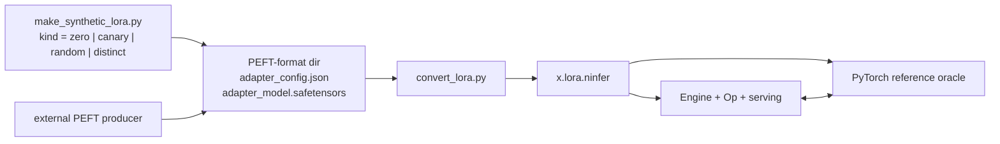

# Runtime LoRA adapters — Qwen3.8-27B

## Status and scope

Opened 2026-08-19; delivered 2026-08-20; the adapter pool replaced the fixed eight-adapter bank on
2026-08-30. This file **is** the current implementation map for Qwen3.8-27B LoRA conversion and
runtime serving. Its boundary begins at a standard PEFT adapter directory produced outside NInfer.
It owns conversion into `.lora.ninfer`, artifact validation, banking and slot residency, execution,
adapter-scoped state, and request routing.

It remains a transitional document. Its stable contracts still owe migration into the permanent
authorities listed at the end of this section, after which this file is deleted.

Deliverable: external PEFT adapters converted to `.ninfer`, discovered from a directory alongside
the base artifact, and selected **per request by the OpenAI/Anthropic `model` string** —
`qwen3.8-27b` runs the unmodified base, `qwen3.8-27b-qlora-math` runs the base plus the `math`
adapter, with no reload between requests.

The pool of servable adapters is unbounded and costs only host memory. Device residency is a
separate, bounded resource: `--lora-slots` slabs are allocated at load and an adapter is swapped
into one at admission, LRU by last use, so a pool of a hundred adapters serves from two slots.

In scope:

- the adapter `.ninfer` contract and its converter;
- one new Op family that applies a low-rank correction with per-token adapter routing;
- directory discovery, bounded slot residency with admission-time swapping, request routing, and
  prefix-reuse isolation;
- serving-side model-name routing and `/v1/models`;
- a synthetic-adapter bring-up ladder that validates all of the above without a trained adapter.

Out of scope: adapter training, target profiles, corpora, training reports, adapters for
`qwen3.6-35b-a3b`, adapter merging into base weights, rescanning the directory after startup, and
target-module sets outside the registered contract. Training is owned by the separate
`llm-datasets` repository. The pool is enumerated once at load; adding a file later requires a
restart.

Pending migration: the adapter inventory belongs in `qwen3.8-27b-artifact.md`, the Op contract in
`op-development.md`, routing and prefix keying in `concurrent-inference-architecture.md`, and the
served surfaces in `serving.md` and `cli.md`. Once those absorb the contracts below, delete this
file.

## 1. Product-contract change

`AGENTS.md` currently states that the registered identities are `qwen3.8-27b/groupwise-int`,
`qwen3.8-27b/nvfp4`, and `qwen3.6-35b-a3b/groupwise-int`, and that `.ninfer` is the only C++ product
artifact. This work adds a **second artifact role** under the same container and a **second
resident weight source**, both explicitly registered. It does not add discovery, plugin loading,
string-driven execution, or runtime allocation.

Changes required in `AGENTS.md` when the work lands:

- "Current product contract" gains: the 27B target additionally accepts a directory of LoRA
  adapter artifacts, enumerated at startup and selected per request by name, of which a
  startup-fixed number are device-resident at a time.
- "Product and ownership boundaries" gains: `tools/convert/qwen3_8_27b` owns adapter conversion;
  `src/ops/lora` owns the low-rank correction Op; the adapter bank is package-owned persistent
  state; serving owns the model-name route table.

Adapter registration is **the directory**: `--lora-dir PATH` enumerates every `*.ninfer` in it,
sorted by filename, and the adapter's name is its filename stem with a trailing `.lora` removed, so
`math7.lora.ninfer` serves as `math7`. There is no per-adapter flag and no name-pattern matching.

This is a discovery mechanism, which the "no plugin discovery" rule in `AGENTS.md` would otherwise
exclude, so the distinction matters. The rule bars discovering *code paths* — execution is still
fully determined by the compiled Variant and the registered base identity. What the directory
enumerates is *weights in a registered format*: every entry is validated at load against the same
inventory, shape and identity contract, and a file that fails it aborts the load. The directory
changes how the set is named, not what may enter it.

## 2. PEFT handoff findings

Adapter training, the Qwen3.8-27B target profile and the pinned training environment are maintained
in `llm-datasets/docs/targets/qwen3_8_27b.md`. NInfer's conversion and runtime paths consume the
resulting standard PEFT adapter directory without importing or invoking that training stack.

### 2.1 HF module names and their NInfer destinations

From `transformers/models/qwen3_5/modeling_qwen3_5.py`:

| HF module | Line | Shape (27B) | NInfer object |
|---|---|---|---|
| `self_attn.q_proj` | `:632` | `[12288,5120]` — head-interleaved 256 query + 256 gate per head | `attention/query_key` rows + `attention/gate_value` rows |
| `self_attn.k_proj` | `:635` | `[1024,5120]` | `attention/query_key` rows |
| `self_attn.v_proj` | `:638` | `[1024,5120]` | `attention/gate_value` rows |
| `self_attn.o_proj` | `:641` | `[5120,6144]` | `attention/output` |
| `linear_attn.in_proj_qkv` | `:417` | `[10240,5120]` | `gdn/query_key` + `gdn/value_z` |
| `linear_attn.in_proj_z` | `:418` | `[6144,5120]` | `gdn/value_z` |
| `linear_attn.in_proj_b` / `in_proj_a` | `:419-420` | `[48,5120]` | `gdn/b_projection` / `gdn/a_projection` |
| `linear_attn.out_proj` | `:403` | `[5120,6144]` | `gdn/output` |
| `mlp.gate_proj` / `up_proj` | `:701-702` | `[17408,5120]` | `mlp/gate_up` |
| `mlp.down_proj` | `:703` | `[5120,17408]` | `mlp/down` |

## 3. Scope decision — supported LoRA target modules

NInfer's fused Ops make two HF module families **structurally impossible** to correct with a
post-hoc additive delta. This is not an implementation shortcut; it is a property of where the
nonlinearity sits. The two vocabulary endpoints are also unregistered, but for different reasons;
they are listed separately at the foot of the table so the two categories are not confused.

| HF module | NInfer call site | v1 | Reason |
|---|---|:--:|---|
| `q_proj` (→ query + gate) | `ops::attn_input_proj` outputs `q_flat`, `gate_flat` | yes | plain BF16 destinations, read-modify-write |
| `k_proj`, `v_proj` | `k_flat`, `v_flat` | yes | same |
| `o_proj` | `ops::linear_add` into `x` (`variant.cpp:163-167`) | yes | already accumulates into the residual |
| `down_proj` | `ops::linear_add` into `x` (`variant.cpp:281`) | yes | same |
| `linear_attn.out_proj` | `ops::linear_add` into `x` (`variant.cpp:259-263`) | yes | same |
| `gate_proj`, `up_proj` | `ops::linear_swiglu` (`variant.cpp:278`) | **no** | the delta must land **before** `silu(g) * u`; `silu(g+dg)*(u+du)` is not decomposable into `silu(g)*u + f(dg,du)` |
| `in_proj_qkv`, `in_proj_z` | `ops::gdn_input_proj_conv_snapshot` (`variant.cpp:213-232`) | **no** | the delta must land **before** the fused causal conv **and** its SiLU. The conv is linear, but a separate delta path would need its own 3-tap persistent state per lane; the SiLU then blocks recombination. |
| `in_proj_a`, `in_proj_b` | `ops::gdn_norm_gating_proj` (`variant.cpp:265-272`) | **no** | `[48,5120]`, fused into the norm+gating leaf; negligible capacity |
| `lm_head` | `ops::linear` into `logits` (`text_context_impl.h:642,747,805,1278`) | **no** | **not structural.** The destination is already a plain contiguous BF16 `[248320,T]` and satisfies the `lora_delta_add` contract. Excluded because this site table and its object names are layer-indexed, and because `text/draft_head` is a row gather of `lm_head` — an unmirrored delta desynchronizes MTP proposals from the target |
| `embed_tokens` | `ops::embedding` (`text_context_impl.h:743,795,1256`) | **no** | a gather, not a matmul: no `[N,T]` destination exists for `B @ (A @ x)`. Needs a new Op computing `out[:,t] += B @ A[:,ids[t]]` |

Supporting the excluded families requires an optional additive-input parameter threaded through the
`linear_swiglu` and `gdn_input_proj*` epilogues across `q4`, `q5`, `w8`, and `nvfp4` — roughly six
kernel families times four codecs. That is a separate project.

The vocabulary endpoints are a different case: `lm_head` is a policy exclusion rather than a
structural one, and `embed_tokens` needs a new Op rather than a modified epilogue. Training-side
module roles and experimental modules are owned by the `qwen3_8_27b` target profile in the separate
`llm-datasets` repository; `convert_lora.py` remains authoritative at the handoff and rejects every
unsupported module by name.

**Registered v1 target-module set:**

```
["q_proj", "k_proj", "v_proj", "o_proj", "down_proj", "out_proj"]
```

`out_proj` is `linear_attn.out_proj`; PEFT matches on the leaf name and it does not collide with
`self_attn.o_proj`. Together these cover the complete attention block in all 16 full-attention
layers, the down projection in all 64 layers, and the output projection in all 48 GDN layers.
`convert_lora.py` **hard-rejects** an adapter containing any excluded module rather than silently
dropping it and derives the site set from the objects actually present. Supported adapters with
different site sets or ranks can share a pool because the runtime normalizes them into its union
profile at the pool's maximum rank (§6.8).

### 3.1 Registered sites

| Site id | Layers | `A` shape | `B` shape | Destination |
|---|---:|---|---|---|
| `attention/query` | 16 | `[r,5120]` | `[6144,r]` | `q_flat[6144,T]` |
| `attention/gate` | 16 | `[r,5120]` (shared with query) | `[6144,r]` | `gate_flat[6144,T]` |
| `attention/key` | 16 | `[r,5120]` | `[1024,r]` | `k_flat[1024,T]` |
| `attention/value` | 16 | `[r,5120]` | `[1024,r]` | `v_flat[1024,T]` |
| `attention/output` | 16 | `[r,6144]` | `[5120,r]` | `x[5120,T]` |
| `gdn/output` | 48 | `[r,6144]` | `[5120,r]` | `x[5120,T]` |
| `mlp/down` | 64 | `[r,17408]` | `[5120,r]` | `x[5120,T]` |

At `r=16`: **42,205,184 parameters**, **84.4 MB** BF16, **368 tensor objects** per adapter.

### 3.2 Why the table includes `gdn/output`

Only 16 of the 64 layers are full attention. Without `gdn/output` the adapted token-mixing path
reaches those 16 and the remaining 48 carry `mlp/down` alone, so three quarters of the model gets a
single adapted projection. The site was registered from the start but the trainer did not target it
until it was measured, which left trained adapters unable to share a bank with the project's own
7-site fixtures.

Adding it costs **+25.8 %** parameters (33,554,432 → 42,205,184), **+50 %** `lora_apply` calls per
step (96 → 144, because each GDN layer gains a second call), and the prefill throughput in §8.1.

Two paired A/B runs measured what it buys. Each holds rank, alpha, steps, seed, schedule and data
fixed so the site set is the only variable, both at `r=16` over a 120-step schedule:

| Probe | n | 6-site | 7-site | Paired result |
|---|---:|---|---|---|
| Register transfer | 185 | 0.9321 mean | 0.9236 | diff **−0.0085**, 95 % CI [−0.027, +0.009], sign test p = 0.26 |
| Held-out math accuracy | 100 | 32 % | **37 %** | 7 discordant wins vs 2, McNemar p = 0.18 |

Neither result is significant and they point in opposite directions. Register transfer is a null
with a tight interval, which is unsurprising: register is largely lexical and `mlp/down` already
covers all 64 layers, so the GDN correction has little to add there. Capability transfer leans
positive, as one would expect if the GDN output projection matters to sequence mixing rather than
to vocabulary, but nine discordant pairs cannot carry a claim.

So the table is complete because the registered contract says it is, and because the token-mixing
path should not be economized on in three quarters of the layers - not because a quality gain was
demonstrated. Do not cite these runs as evidence that a 7-site adapter is better; cite them as the
reason not to expect a large difference at `r=16` on a short schedule.

The register arm reused the `caveman_pirate` corpus and scorer from the separate `llm-datasets`
repository as a convenient paired probe. It is **not** the persona measurement: it omits the two
baselines, the per-stratum headline, the competence and JSON gates, and the strength sweep, and it
runs at a rank and schedule that experiment specifies against. Its authority is
`llm-datasets/docs/persona-adapter.md`; nothing here should be read as a result for it.

### 3.3 REVISIT: decision adapters use only these six modules

> Deliberate limitation, chosen 2026-09-29. Re-evaluate once served decision metrics exist.

System One decision adapters (§4.6) use exactly the registered module set above plus the pointer
head. The reference decision model, Kev-27B on the same `Qwen/Qwen3.8-27B` base, adapts every linear
layer: attention q/k/v/o, the GDN input projections and `out_proj`, and MLP gate/up/down. The
excluded families are excluded for the structural reasons in the table above, and accepting that for
decisions keeps the shared LoRA kernels, the chat adapters' prefill/decode cost, and the slab size
unchanged; rank remains the capacity lever.

**Risk.** Decision accuracy and calibration may fall below the all-linear recipe. Part of any gap
also comes from NF4 QLoRA training and quantized serving, so the two causes have to be separated
before blaming the site set.

**Evidence, 2026-09-29.** `systemone-decision-v7` was trained at rank 16 on the six modules plus the
head, for one epoch on the decision-v7 train split, with `T = 1.414`. It was served from the
groupwise-int artifact with BF16 KV on an RTX 4090, and `llmdata.probes.systemone` scored the
clean knowable questions. The locked test partition was scored once, on the final build:

| | Questions | Accuracy | Brier | NLL | ECE |
|---|---:|---:|---:|---:|---:|
| served, development | 1,264 | 0.871 | 0.184 | 0.356 | 0.024 |
| served, locked test | 1,200 | 0.856 | 0.190 | 0.355 | 0.020 |
| trainer, NF4 base, development at `T` | 1,264 | 0.876 | 0.181 | 0.345 | 0.027 |
| Kev-27B, published, development / locked test | | 0.866 / 0.870 | | | |

Kev publishes no decision-v7 Brier. The accuracy standard error is about 0.01 on each split.
Development is 0.005 above Kev-27B and the locked test 0.014 below it, 1.4 standard errors. Neither
split shows a significant gap to the all-linear recipe, though the test point estimate is lower.
Kev-27B also trained on `round6/b1v2` (decision-v7 plus date, unknowable, long-state and soft-target
records), a superset of the data here. On the test, `score` questions are the weakest type (0.596,
against 0.913 for `choice` and 0.929 for `noul`), as they are on development.

The served-to-trainer difference comes from the training base, not from the engine or the site set.
Over the 280 gate questions, the PyTorch row-form reference on the `.ninfer` base differs from the
trainer's NF4 rows by max |Δp| 0.166 (mean 0.020, 5 argmax flips). The served engine differs from
that reference by 0.029 (mean 0.0025, no flips). The KV codec does not move these metrics
measurably ([serving fidelity](../serving.md#system-one-fidelity)).

**Evidence still to collect.** Optionally, a PyTorch-only control trained with all-linear targets on
the same data and recipe and evaluated in the trainer. It would isolate the site effect. Kev-27B's
better-known 0.896 / 0.160 figures are the out-of-domain transfer-v4 locked test, not decision-v7.

**What revisiting would take.** LoRA inside `linear_swiglu` as a pre-activation delta for gate and
up; LoRA inside `gdn_input_proj` and its conv snapshot/record forms; larger slabs in every slot
(gate/up alone is about 92 MB per slot at rank 16 and 369 MB at rank 64, GDN inputs about 33 MB per
slot at rank 16); slower LoRA prefill/decode for chat adapters too; and updates to the converter and
binder site tables and to the `llm-datasets` target profile. The same note lives in
`llm-datasets/docs/targets/qwen3_8_27b.md`.

## 4. Adapter artifact contract

### 4.1 Container

Reuse the `.ninfer` v2 container **unchanged**. No new `NumericFormat`, no new `StorageLayout`, no
new `ResourceEncoding`: every object is `BF16` / `contiguous-le-v1`, rank 2, 256-byte aligned. The
existing reader, binder, materializer, and `typed_binding.cpp:65-81` handle it as-is.

```json
{"identity": {"model_id": "qwen3.8-27b", "weights_id": "lora-bf16"}, "objects": [...]}
```

The adapter carries **no frontend resources** — the tokenizer, chat template, and preprocessor
configs belong to the base artifact. This is why the SHA-256 pin table
(`tools/convert/qwen3_8_27b/convert.py:34-53`, enforced at `:107-116`) is irrelevant here: an
adapter never carries those six files, so a trainer's re-serialization of `tokenizer.json` cannot
break adapter conversion.

`model_id` is the **base** model id, not the served name. It is the load-time compatibility check.
The served name comes from the artifact's **filename** within `--lora-dir` — its stem with a
trailing `.lora` removed, so `math7.lora.ninfer` serves as `math7`. Naming is deployment
configuration, not artifact identity: renaming the file renames the served model and changes
nothing else, because everything that must survive a rename — continuation scoping and snapshot
identity — keys on the artifact's SHA-256 instead (§6.6).

### 4.2 Object names

```
text/layers/{l}/attention/query_gate/lora_a     [r,5120]     l in full-attention layers
text/layers/{l}/attention/query/lora_b          [6144,r]
text/layers/{l}/attention/gate/lora_b           [6144,r]
text/layers/{l}/attention/key/lora_a            [r,5120]
text/layers/{l}/attention/key/lora_b            [1024,r]
text/layers/{l}/attention/value/lora_a          [r,5120]
text/layers/{l}/attention/value/lora_b          [1024,r]
text/layers/{l}/attention/output/lora_a         [r,6144]
text/layers/{l}/attention/output/lora_b         [5120,r]
text/layers/{l}/gdn/output/lora_a               [r,6144]     l in GDN layers
text/layers/{l}/gdn/output/lora_b               [5120,r]
text/layers/{l}/mlp/down/lora_a                 [r,17408]    all 64 layers
text/layers/{l}/mlp/down/lora_b                 [5120,r]
```

A site absent from the adapter is absent from the artifact; the binder plans a null site and the Op
skips it. A partially-targeted adapter is valid.

### 4.3 Scale folding

`scale = lora_alpha / r`, or `lora_alpha / sqrt(r)` when `use_rslora` is true. It is folded into
`B` at conversion time. There is **no runtime scale parameter** — the engine never sees `alpha` or
`r` semantics, only bank geometry.

### 4.4 `q_proj` de-interleave

HF `q_proj.weight` is `[12288,5120]` viewed as `[24 heads, 512, 5120]`, rows `0:256` query and
`256:512` gate per head (`tools/convert/qwen3_8/common/recipe.py:110-125`). PEFT's `lora_B` for
`q_proj` is `[12288,r]`. Because `delta = B @ A`, row-slicing `B` row-slices `delta`, so the split
is exact:

```
B_hf.reshape(24, 512, r)
  [:, 0:256, :].reshape(6144, r)   -> attention/query/lora_b
  [:, 256:512, :].reshape(6144, r) -> attention/gate/lora_b
```

`lora_A` is emitted once as `attention/query_gate/lora_a` and bound by both sites.

### 4.5 Converter — `tools/convert/qwen3_8_27b/convert_lora.py`

```
python3 -m tools.convert.qwen3_8_27b.convert_lora --adapter <peft_dir> --out <x.lora.ninfer>
```

Requires no base checkpoint. Validates `peft_type == "LORA"`; rejects DoRA (`use_dora`), `loftq`,
`modules_to_save`, non-zero `lora_dropout` at inference, `bias != "none"`, and any target module
outside §3. Accepts both key prefixes, since `text_only=True` collapses the VLM wrapper:

```
base_model.model.model.language_model.layers.{l}.self_attn.q_proj.lora_A.weight
base_model.model.model.layers.{l}.self_attn.q_proj.lora_A.weight
```

PEFT convention: `lora_A.weight` is `[r, in_features]`, `lora_B.weight` is `[out_features, r]`.
Writes a `<out>.conversion.json` report mirroring `tools/convert/qwen3_8/common/conversion.py:187-243`.

### 4.6 Decision adapters

An adapter has one of two kinds under the same `qwen3.8-27b/lora-bf16` identity. A **generative**
adapter carries only the factors above and serves chat. A **decision** adapter additionally carries
the System One pointer head and serves only `/systemone` decisions; each kind is rejected on the
other's route. The kind is the presence of the head: all five objects below are present together or
not at all, and the binder rejects a partial set.

```
decision/head/query/weight    BF16 [256,5120]
decision/head/query/bias      BF16 [256]
decision/head/key/weight      BF16 [256,5120]
decision/head/key/bias        BF16 [256]
decision/metadata             raw-bytes-v1 UTF-8 JSON
```

The head is kev's `PointerHead`, read from the final-RMSNorm hidden state `h` at each option's
closing `<|box_end|>` and at the question's decide `<|fim_suffix|>`:

```
q = Wq h_decide + bq,   k_i = Wk h_option_i + bk,   p = softmax_i((k_i . q) / (16 T))
```

`decision/metadata` holds exactly these keys, each validated at conversion and again at discovery:

| Key | Value |
|---|---|
| `format`, `format_version` | `ninfer-decision-head`, `1` |
| `pointer_dim`, `hidden_size` | `256`, `5120` |
| `logit_scale` | `0.0625` (the `1/16` above) |
| `temperature` | calibrated `T > 0`, exactly representable in FP32 |
| `readout` | `final_norm` |
| `escape` | `kev-v1`: `<\|name\|>` in rendered text becomes `<¦name¦>` before tokenization |
| `delimiters` | role → token: `state` `<\|fim_prefix\|>`, `question` `<\|fim_middle\|>`, `option_open` `<\|box_start\|>`, `option_close` `<\|box_end\|>`, `decide` `<\|fim_suffix\|>` |
| `description`, `release_date` | served on `GET /systemone/v1/models`; `release_date` is `YYYY-MM-DD` |
| `base_model` | the trainer's base checkpoint, recorded for provenance |

The engine resolves the delimiter names through the base tokenizer at load and rejects an adapter
whose recorded delimiters differ from the registered set. Temperature, description, and release date
are host-side pool metadata; the head Op receives `1/(16 T)` as a scalar.

Conversion takes the trainer's hand-off file by its canonical name, never by glob:

```
python3 -m tools.convert.qwen3_8_27b.convert_lora --adapter <peft_dir> \
  --decision-head <peft_dir>/decision_head.safetensors \
  --description "..." --release-date YYYY-MM-DD --out <name>.lora.ninfer
```

`decision_head.safetensors` holds FP32 `query.weight` `[256,5120]`, `query.bias`, `key.weight`, and
`key.bias`, with safetensors metadata `format=systemone-pointer-head`, `format_version=1`,
`pointer_dim`, `hidden_size`, `logit_scale`, `temperature`, `readout`, `escape`, `delimiters`
(JSON), and `base_model`. The converter rounds the head to BF16, validates shapes, the delimiter set,
and the scale, and records `kind` and the decision metadata in the conversion report.

**Slab.** When the pool holds any decision adapter, every slot gains a head region after its sites:
2 × (256 × 5120 + 256) × 2 B = 5.0 MiB per slot. A generative occupant stages zeros there, and no
decision reads a generative slot because decisions select only decision adapters. A pool without a
decision adapter has no head region, so chat-only deployments pay nothing.

**Identity.** The adapter's content fingerprint is the complete-artifact SHA-256, so it covers the
head and its metadata: a head-only retrain or a recalibrated temperature is a different adapter scope
and never reuses the previous adapter's cached states.

## 5. Op contract — `ops::lora_delta_add`

New family `src/ops/lora/`, contract at `include/ninfer/ops/lora.h`.

```cpp
namespace ninfer::ops {

struct LoraSite {                       // one (A,B) pair, banked over adapters
    const void* a = nullptr;            // BF16 [rank, k], adapter-strided; nullptr => inactive
    const void* b = nullptr;            // BF16 [n, rank],  adapter-strided
    std::int32_t n = 0, k = 0;
    std::size_t a_adapter_stride = 0;   // bytes between consecutive adapters
    std::size_t b_adapter_stride = 0;
};

struct LoraGroup {                      // one launch; all sites share the same input x
    std::int32_t rank = 0;              // padded bank rank, one of {8,16,32,64}
    std::int32_t adapter_count = 0;
    std::int32_t site_count = 0;        // 1 or 4
    std::array<LoraSite, 4> sites{};
};

[[nodiscard]] std::size_t lora_delta_add_workspace_capacity_bytes(std::int32_t rank,
                                                                  std::int32_t site_count,
                                                                  std::int32_t min_tokens,
                                                                  std::int32_t max_tokens);

void lora_delta_add(const Tensor& x, const LoraGroup& group, const Tensor& adapter_index,
                    std::span<Tensor* const> destinations,
                    WorkspaceArena& workspace, cudaStream_t stream);

} // namespace ninfer::ops
```

Semantics, for every site `s` and every token column `t`:

```
a = adapter_index[t]
if a >= 0:  destination_s[:, t] += B_s[a] @ (A_s[a] @ x[:, t])
```

- `x` is contiguous BF16 `[K,T]`; every `destination_s` is contiguous BF16 `[N_s,T]` and is updated
  **in place**. `a < 0` contributes nothing to that column.
- `adapter_index` is I32 with `ne[0] == T` (per-column, decode/verify) or `ne[0] == 1` (uniform,
  prefill).
- Mixed adapter ranks are handled by **zero-padding `B` to the bank rank**; padded `A` rows then
  contribute exactly nothing. One compile-time bank rank, no per-adapter rank table.
- **`A16Only`.** BF16 operands, FP32 accumulation, BF16 store. INT8 activation profiles are not
  admitted: `Verify` is the phase CUDA Graphs capture and it must stay bit-identical to the A16
  catalog (`src/targets/qwen3_8_27b/impl/variant.cpp:65-80`).
- Oracle per `op-development.md`: one independent naive FP32 evaluation of
  `destination_in + B·(A·x)` from the represented BF16 inputs. Accumulator order, staging, and
  kernel decomposition are private.
- No persistent state. Workspace is caller-owned, graph-stable transient storage holding the
  `[rank, T]` intermediate per site.

The `attention/query` and `attention/gate` sites point at the **same** `A` object; the kernel
computes four independent `A`-projections rather than deduplicating. At `r=16`, `K=5120`, `T=8`
that redundancy is 655 K MACs — negligible against the `B` work, and it keeps the kernel uniform.

### 5.1 Precedent

`sparse_moe` is the closest existing analogue: "expert `e` directly selects its stored row spans;
no selected-weight gather or repack occurs" (`include/ninfer/ops/sparse_moe.h:53-54`). Adapter
banking is the same pattern with `adapter_index` in place of the router.

## 6. Engine integration

### 6.1 Why this is CUDA-Graph safe

Three existing mechanisms carry the whole design:

1. **Per-column routing already exists.** `lanes[B]` in `OrdinaryDecodeIngress`
   (`src/targets/qwen3_8/export/ninfer/targets/qwen3_8/round_state.h:31-38`) is a device-resident
   per-batch-row selector for GDN state. `adapters[B]` is byte-for-byte the same pattern.
2. **The H2D upload is inside the captured graph.** `decode_impl.h:20-22` copies the whole
   `OrdinaryDecodeIngress` from a fixed pinned host address every replay. Adding a field changes
   the struct, not the topology.
3. **Slot count is startup-fixed**, so bank base pointers and strides are kernel constants and the
   bank lives in the persistent arena, which is one `cudaMalloc` with deterministic offsets
   (`src/core/arena.cu:189-214`).

Swapping an adapter into a slot does not disturb any of this, and the reason is worth stating
precisely. Capture freezes four things: the bank base pointer, the slab stride, the site geometry,
and the rank — the last because it is a host-side template switch at
`src/ops/launcher/lora_delta.cu:82-89`. A swap changes none of them; it overwrites the *bytes* at a
fixed device address between rounds, which a captured graph cannot observe. The one thing that does
vary per replay, `adapters[B]`, is a device-resident runtime value already re-uploaded every replay
by mechanism 2 above.

That is also why the pool is unbounded while the slots are not. The frozen quantities all scale with
the *slot* count; nothing in the captured graph scales with how many adapters exist on disk.

**Maximal batched decode is preserved.** Mixed-adapter batches execute in one round; there is no
cohorting by adapter, so the §2.1 invariant in `concurrent-inference-architecture.md:60-63` is not
weakened.

**Zero cost when unused.** With no `--lora-dir`, `StartupFeatures::lora_slots == 0`, the LoRA leaves
are not emitted, and the captured graph is topologically identical to today. Base-model throughput
is provably unchanged.

`startup_features()` reads the **requested** slot count, not the count the bank ended up with. A
pool smaller than `--lora-slots` clamps the allocation, but the frozen feature set must depend only
on `EngineOptions`, or the features computed before load would not match the features after it.

### 6.2 Family runtime — `src/targets/qwen3_8/`

| File:line | Change |
|---|---|
| `export/ninfer/targets/qwen3_8/startup_features.h:7-26` | `+ std::uint32_t lora_slots = 0;` and `bool lora() const noexcept`; populate in `startup_features(options)` at `:28-35` |
| `export/ninfer/targets/qwen3_8/round_state.h:31-38` | `+ std::array<std::int32_t, kMaximumConcurrency> adapters{};` in `OrdinaryDecodeIngress`; same in `MtpDecodeIngress` (`:46`) and `DFlashDecodeIngress` (`:72`) |
| `impl/state/round_state.cpp:81-110` | `+ adapters = ingress_tensor(offsetof(OrdinaryDecodeIngress, adapters), DType::I32);` |
| `impl/runtime/text_context.h:75-97` | `+ LoraSiteViews` on `FullLayerW`, `GdnLayerW`, `MlpW`; bind at `text_context_impl.h:262-318` |
| `impl/runtime/text_context_impl.h:811`, `:850`, `:955`, `:964` | insert `Variant::lora_*` calls guarded by `features.lora()` |
| `impl/runtime/layouts_impl.h` `attention_stage`/`gdn_stage`/`post_mixer_stage` | `+ scratch(layout, ...)` for the LoRA groups. The layout is frozen before any adapter artifact is read, so it is sized for `StartupFeatures::lora_sizing_rank`, which is `kMaximumLoraRank` whenever adapters are registered. The bank's executed rank lives on the model view. The difference is well under a MiB of transient scratch. The bank itself is not a `PersistentLayout` region: it is its own `DeviceArena` owned by `LoadedModelData`, committed before KV capacity is resolved so the authoritative resolver already excludes it |
| `impl/runtime/workspace_recipe.h` | `+ lora_intermediate<Config>(alloc, rank, site_count, T)`, mirrored into `layouts_impl.h` `attention_stage` / `gdn_stage` / `post_mixer_stage` (`:258-308`) so `WorkspaceLayoutBuilder` sizes it |
| `impl/runtime/program_impl.h:2640-2667` | fill `ordinary_host_ingress->adapters[row]` beside `lanes[row]`, translating the lane's pool index through `lora_slot()`; the same translation at the MTP and DFlash ingress and at `PrefillContext::adapter` |
| `impl/runtime/program_impl.h` residency policy | `lora_slot`, `lora_slot_pinned`, `ensure_adapter_resident`, `adapter_scope`, and the slot table (§6.8) |

No new graph profiles. `ordinary_graph_profiles` (`variant.cpp:108-146`) and `topology_class` are
untouched.

### 6.3 Package — `src/targets/qwen3_8_27b/`

Three of the four correction points are ordinary family-level `ops::lora_delta_add` calls, because
their input activation and their destinations are already materialized in the family text schedule
next to `ops::rmsnorm` and `ops::rope`:

| Correction | Sites | Input | Destinations |
|---|---|---|---|
| attention projection | 4 | `h[5120,T]` | `q_flat`, `gate_flat`, `k_flat`, `v_flat` |
| attention output | 1 | `a[6144,T]` | `x[5120,T]` |
| GDN output | 1 | `on[6144,T]` | `x[5120,T]` |

The down projection is different and **must** live inside the package leaf. Its delta acts on the
SwiGLU activation, which `Variant::post_mixer` allocates from its own workspace scope between
`ops::linear_swiglu` and `ops::linear_add` and never exposes. The package therefore gains a peer
leaf, `Variant::post_mixer_lora`, which runs swiglu, the fused down/residual add, and then the
correction against the activation it still owns, plus a
`post_mixer_lora_workspace_capacity_bytes` query. The activation stays live across the correction,
so its bytes are additive rather than shared with the projection scratch.

LoRA support is a compile-time Variant trait, `static constexpr bool supports_lora`, in the same
shape as the existing `supports_dflash`. The 27B package sets it true; Qwen3.6-35B-A3B sets it
false, because its post-mixer is a sparse MoE whose down projection is per-expert and is not
covered by the registered additive site contract. That package needs no LoRA leaf, no stub, and no
runtime branch. Because `Variant` is a concrete typedef inside each instantiation rather than a
template parameter, the family routes the call through a `post_mixer_with_lora<V>` helper so the
discarded branch is genuinely dependent and never name-looked-up.

Adapter binding, pool discovery and slot residency live in `impl/load/lora_bindings.{h,cpp}`.
`discover_lora_pool` enumerates the directory, opens each artifact once, validates its identity and
records its inventory, rank, and SHA-256 content fingerprint. Discovery also rejects every object
outside the registered site table rather than accepting a partially understood adapter.

`LoraBank` then derives one **union profile** over the pool — the union of every adapter's sites at
the maximum of every adapter's rank — and allocates `slots` identical slabs of it in a single
`DeviceArena`. Every site's slot stride is the same constant, and every plane address is
deterministic and fixed for the process. `LoraBank::stage(slot, index)` assembles one slab in pinned
host memory and uploads it in one contiguous transfer. It reopens the artifact and verifies its
fingerprint before every stage: a long-lived read-only mmap is not an immutable snapshot because a
same-inode write can change the pages underneath it. The reader uses the configured fingerprint
sidecar cache, so unchanged files avoid rehashing when that cache is enabled.

Normalizing to the union is what lets a heterogeneous directory share one captured graph, and it is
not free: an adapter that omits `gdn/output` still executes the GDN correction against zeros,
costing the 1.2–1.6 % measured in §8.1. Charging every adapter for the widest one is the price of
not having a graph topology per adapter. Padding is exact — a missing site and a rank tail are
memset to zero, so a narrow adapter computes the same delta it would in a bank of its own, which
`ninfer_qwen3_8_27b_lora_pool_test` checks by reading the staged slab back and comparing it against
the artifact's bytes.

`Package::attach_lora` moves the bank into `LoadedModelData` and publishes the pool's names,
fingerprints, and the real slot count.

### 6.4 Multi-artifact load — `src/targets/registry.cpp:82-134`

`construct_registered` calls `Target::attach_lora` between `construct_loaded_model` and the
authoritative `resolve_kv_capacity`. Because that resolution reads `current_free_device_bytes()`,
the committed bank is accounted for without a separate preflight term; the earlier preflight call
is a discarded sanity check on the base weights only. A missing or empty directory, a foreign
identity, a malformed inventory, and a duplicate name all throw at load with the offending path or
name in the message.

Two former load errors are gone. Pool size is unbounded, so there is no count to exceed; and a rank
disagreement is now absorbed by the union profile rather than rejected. A slot count above the pool
size is clamped rather than refused, because the excess would be an allocation no request could ever
use.

### 6.5 Public API — `include/ninfer/types.h`

```cpp
struct LoraOptions {                            // new
    std::filesystem::path directory;            // empty => LoRA disabled entirely
    std::uint32_t slots       = 2;              // device-resident adapters
    std::int32_t rank_ceiling = 0;              // 0 => the pool's maximum rank
};

// EngineOptions
LoraOptions lora;

// ExecutionOptions
std::optional<std::string> adapter;             // nullopt => base weights only

// LoadSummary
std::vector<std::string> lora_adapter_names;    // pool order; unbounded
std::uint32_t lora_slots;                       // resident slots the bank committed
```

`kMaximumLoraAdapters` and `LoraAdapterSpec` are gone. Nothing in the public surface bounds the pool
any more; `slots` bounds the only thing that is actually scarce.

The default of two slots is deliberate. One slot is correct but serializes any request whose adapter
differs from the running one, which for a mixed workload is worse than the swap it avoids. Setting
`--lora-slots` equal to `--max-concurrency` removes admission stalls entirely at the cost of one
slab per lane.

`resolve_request_options` (`src/runtime/engine/engine.cpp:24-35`) resolves the name to an index;
an unregistered name raises `RequestError`. The index is carried on
`ResolvedExecutionOptions` (`src/runtime/contract/types.h:24-28`) and reaches
`Request` (`src/runtime/engine/concurrent_executor.h:863`).

### 6.6 Prefix reuse and KV correctness

KV and GDN recurrent state produced under adapter A are **invalid** for adapter B. This is a
correctness requirement, not an optimization. Three mechanisms enforce it:

- `SequenceState::adapter` records which **pool index** produced a lane's continuation. Pool index
  and slot index are distinct and must not be confused: the pool index is the adapter's semantic
  identity and is what appears in sequence state, snapshots and cache keys, while the slot index is
  pure device residency and appears only in the three `adapters[row]` ingress writes and
  `PrefillContext::adapter`. `lora_slot()` is the only translation between them.
  `plan_request_for_lane` refuses resident-prefix reuse unless it matches the request, so a lane
  holding another adapter's state simply reports zero reusable tokens and is treated as a full
  reset. `find_admission_lane` needs no adapter-specific rule because it already ranks lanes by
  planned reusable tokens.
- Every continuation-cache alias is namespaced by adapter through `adapter_scoped_alias`, applied
  to both the session `routing_hint` and the stable-prefix alias. The scope string comes from
  `Program::adapter_scope`, which returns the adapter's fingerprint rather than its pool index, for
  the same reason the snapshot does. Scoping is unconditional, including the base weights, so no
  unscoped key exists and two adapters cannot collide. `import_continuation_lane` takes the
  requesting adapter and stamps it onto the restored sequence.
- The snapshot (version 4 onward) carries `SnapshotSession::adapter` as a **32-byte SHA-256 content
  fingerprint** of the adapter's artifact, all-zero meaning base weights. It is written from the
  pool entry that produced the lane and resolved back to a pool index on restore, which then calls
  `ensure_adapter_resident` before the image is accepted.

  Versions 2 and 3 stored the bank index, which was sufficient identity only because
  `slot_model_binding` folded the whole registered name list and its order into the slot digest.
  A directory-discovered pool destroys that premise: adding one file renames every index after it,
  and the binding cannot pin a set that is no longer declared. A fingerprint is positional-order
  independent and survives the pool being reordered, extended, or pruned; an adapter that is no
  longer in the directory now fails to resolve and the image is refused, where an index would have
  silently restored the wrong adapter's state.

  The surrounding model binding independently carries the complete base artifact's SHA-256. It no
  longer carries the adapter name list: the base fingerprint pins the exact base weights, the
  session fingerprint pins the exact adapter, and adding an unrelated pool entry changes neither.

  Getting this wrong is not a cache miss. Before `SnapshotSession::adapter` existed at all, a
  restored lane kept whatever adapter its previous occupant had left behind — a slot saved under an
  adapter restored as base, and the next base request with a matching prefix reused adapter-encoded
  KV and GDN state.

### 6.7 Speculative decoding

MTP weights are separate (`mtp/*`) and carry no adapter. Target verify runs the adapted layers;
the draft does not. Acceptance rate therefore degrades on an adapted model by an amount
proportional to the adapter's effect. `MtpDecodeIngress` still needs `adapters[B]` because the
**target** pass is adapted. This is accepted and documented, not fixed, in v1.

Measured, with `--spec mtp --draft-tokens 3` on the 120-step math adapter over 8 held-out prompts
at a 96-token budget:

| Model | Rounds | Drafted | Accepted | Tokens/round | Accept rate |
|---|---:|---:|---:|---:|---:|
| base | 209 | 623 | 548 | 3.62 | **88.0%** |
| + adapter | 53 | 159 | 105 | 2.98 | **66.0%** |

Acceptance falls by about a fifth and the draft window yields 2.98 tokens per round instead of
3.62. This adapter is close to a worst case - its salient behaviour is a first-token flip on
essentially every prompt, which is exactly the argmax disagreement an unadapted draft cannot
predict - but the direction is structural, not specific to it.

Read the round counts as scale, not as a speed comparison: the arms do not generate the same text.
The adapted model answers in terse JSON and stops early, while the base model writes prose to the
96-token budget, so the base arm simply produces far more tokens. An adapter changes what the model
says, so no acceptance comparison between an adapted and an unadapted model can hold the output
distribution fixed. The operational claim - enabling an adapter costs acceptance - is unaffected.

Published MTP figures in `performance.md` are base-model figures and do not describe adapted
serving.

### 6.8 Slot residency

The pool lives on disk and in host mappings; the bank holds `slots` device slabs. The policy that
connects them is in `ProgramImplCore` and is deliberately small.

`ensure_adapter_resident(adapter, release_retained)` returns true if the adapter is already in a
slot, refreshing its use clock. Otherwise it takes an empty slot, or failing that the least recently
used slot that is not pinned, evicts it, stages the adapter, and returns true. It returns **false**
only when every slot is pinned.

A slot is pinned while any lane whose lifecycle is `Prefilling`, `Active` or `Pending` names its
occupant. Those lanes hold KV and GDN state produced by that adapter's weights; changing the bytes
underneath them would not fail, it would silently continue their generation against a different
model. A merely `retained` lane is a *soft* hold: its request is finished, and its L1 state is a
reuse optimization. Evicting its adapter hands it to the caller through `release_retained`, which
lets the executor publish the session to L2/L3 and keep its own retention accounting straight —
dropping the lane here would destroy the state instead of demoting it. Any remaining lane that still
names the evicted adapter has its `adapter` reset to `-1`, so no idle lane can later be reused
against weights that are no longer there.

Staging is two-phase. Prepare reopens, fingerprints and assembles the artifact before any retained
lane is displaced; ordinary file failures therefore leave residency untouched. Commit clears the
slot identity, performs the one upload, and records the new occupant only on success.

**Where it runs.** `try_admit_one` first proves the request fits and has a usable lane, then settles
residency, then calls `try_restore_continuation`. That ordering prevents a rejected candidate from
evicting unrelated retained state, while still ensuring restore never imports state for an adapter
that cannot run. A false return is adapter-only contention: the scheduler drains rather than feeding
it to the KV/lane protection policy, whose precondition is a request actually blocked by those
resources. The request stays queued subject to its deadline. It cannot deadlock because an idle
engine pins nothing, and it cannot starve because every admission pass evaluates the head before
any backfill.

**Cost.** One swap is a verified artifact reopen, bounded host assembly of one slab, and one
contiguous upload: **46.8 ms** for an 80 MiB union slab without a fingerprint sidecar cache on this
target, measured by `ninfer_qwen3_8_27b_lora_pool_test`. It runs on the worker thread between rounds,
with no replay in flight, and is amortized against the prefill of the request that caused it.
`lora_stage_count` counts swaps for anyone who wants to confirm a workload is not thrashing.

## 7. Serving and model routing

Adapter names are registered as bare names; the served model id for each is
`<public model id>-<name>`.

| File | Change |
|---|---|
| `src/serve/http_server.h` | `+ adapter_model_ids_` and `+ adapter_names_` beside `public_model_id_`; `+ resolve_model()` returning `std::optional<std::string>` (nullopt = 404, empty = base) |
| `src/serve/http_server.cpp` `attach` | build `adapter_model_ids_` from `load_summary().lora_adapter_names` |
| `src/serve/http_server.cpp` chat completions | exact-match 404 → `resolve_model`, writing `request.adapter` |
| `src/serve/http_server.cpp` `handle_model`/`handle_models` | `resolve_model` gate; `/v1/models` lists base + every adapter |
| `src/serve/openai_schema.{h,cpp}` | `make_models_list` takes the adapter model ids |
| `src/serve/request.h` | `GenerationRequest::adapter` |
| `src/serve/translate.cpp` | `options.execution.adapter = request.adapter` when non-empty |
| `src/serve/serve_options.{h,cpp}` | `--lora-dir PATH`, `--lora-slots N`, `--lora-rank R`, plus usage text |
| `src/serve/generation_service.cpp` | `engine_options.lora = options_.lora` |
| `apps/cli/options.{h,cpp}`, `apps/cli/main.cpp` | the same three flags and `--adapter NAME` |
| `include/ninfer/types.h` | `RequestErrorKind::UnknownAdapter`, mapped to 404 `model_not_found` on `param: "model"` |

The Responses surface validates model names through the same route table. The Anthropic surface
keeps its documented "accept any Claude model name and echo it" contract while resolving a
registered adapter model id when one matches.

```
ninfer-serve models/qwen3_8_27b.ninfer --lora-dir adapters --lora-slots 4
```

With `adapters/` holding `qlora-math.lora.ninfer` and `qlora-python.lora.ninfer`:
`model: "qwen3.8-27b"` → base, `model: "qwen3.8-27b-qlora-math"` → the `qlora-math` adapter.
Anything else → 404 on the OpenAI surface. `/v1/models` lists the base plus every pool entry,
however large the pool is; `slots` bounds only how many are resident at once.

## 8. Cost model

At `r=16`, all seven sites, per adapter:

| Quantity | Value |
|---|---|
| Parameters | 42,205,184 |
| VRAM | 84.4 MB **per slot** (169 MB at the default two slots) |
| Host cost per pool entry | name, path, fingerprint, rank and site inventory |
| Swap cost | 46.8 ms without a fingerprint cache — verify, assemble one slab, upload once |
| Tensor objects | 368 |
| Extra kernel launches per decode step | 144 (16 full-attention layers × 3, 48 GDN layers × 2) |
| Extra bandwidth per decode step | 84.4 MB against an 18.2 GB base weight read — **0.46 %** |

Launch overhead is the term to watch, not bandwidth: 144 in-graph node launches at roughly
0.3–0.5 µs each is on the order of 50–70 µs against a decode step of roughly 19 ms — an estimated
**0.3–0.4 %**. That figure is a decode projection and has not been measured. Decode remains the
open half of this section; the published claim must come from `bench/targets/qwen3_8_27b` at `B=1`
and `B=8` with 0, 1, and 8 adapters registered.

Base requests served by a LoRA-enabled process pay the launch cost with `adapter_index = -1`,
because graph topology is fixed at capture. A process started without `--lora-dir` pays nothing.

Device cost is now set by `--lora-slots`, not by how many adapters are servable: the pool itself
costs no VRAM. What the pool does cost is the union tax — every adapter executes the widest site set
in the directory, so mixing a 6-site adapter into a directory containing a 7-site one gives up the
1.2–1.6 % below for the narrow one. Splitting genuinely different site sets across separate
directories and processes is the way to avoid that; it is not worth a second graph topology.

### 8.1 Prefill, measured

Prefill was outside the model above, and it is the larger term. RTX 4090 `sm_89`, one lane, KV
`rk4v4-e8`, `prefill_chunk` 1024, continuation cache off and prefix reuse disabled, one warm-up
request discarded, three repeats, `prefill_tok_s` from the structured request log. SM clock held
2715–2730 MHz at 465–475 W throughout, so no arm was throttled.

| Prompt tokens | No `--lora-dir` | Bank resident, base request | Adapter selected |
|---:|---:|---:|---:|
| 9,411 | 3600 tok/s | 3601 tok/s | 3307 tok/s (**−8.2 %**) |
| 37,798 | 3250 tok/s | 3247 tok/s | 3017 tok/s (**−7.1 %**) |

Within-arm spread was ≤1 %, so both effects are outside the noise. These are the complete 7-site
table. The same protocol against a 6-site adapter, which omits `gdn/output` and so issues 96
`lora_apply` calls per step instead of 144, gives 3360 and 3054 tok/s, so the GDN correction across
48 layers accounts for a further **1.2–1.6 %**. A 50 % increase in launches costing under 2 % is
consistent with launch overhead being amortized across a 1024-token chunk.

Two results. A resident but unselected bank costs nothing measurable in prefill — the 144 extra
launches amortize over a 1024-token chunk instead of a single decode step. And selecting an
adapter costs about **6 %** of prefill throughput, roughly an order of magnitude more than the
decode projection above.

That 6 % is not explained by arithmetic. At `r=16` the added work is `2·T·r·(in+out)` against a
base `2·T·in·out`, which for these shapes is under 1 % of the adapted GEMMs' FLOPs. The cost is
shape: a rank-16 GEMM is extremely skinny, so both halves are dominated by streaming the `[T, in]`
activation in and the `[T, out]` result out rather than by the multiply, and the prefill base GEMMs
they are compared against are the fast A8 route. Anyone trying to close this gap should attack
activation traffic — fusing the correction into the base epilogue — not the FLOPs.

## 9. Synthetic adapter ladder

A LoRA `A`/`B` pair is **independent of base weights** — only shapes matter, and those are fixed
constants for this target. A synthetic adapter therefore needs no source checkpoint or training
stack. Together with `models/qwen3_8_27b.ninfer` and `build-sm89/`, this validates the complete
NInfer conversion/runtime path without depending on an external producer.



The generator emits **PEFT-format** directories rather than `.ninfer` directly, so the fixtures
exercise `convert_lora.py` as well. Converter bugs are caught, not baked in.

### 9.1 Generator — `tools/convert/qwen3_8_27b/make_synthetic_lora.py`

```
python3 -m tools.convert.qwen3_8_27b.make_synthetic_lora \
    --kind zero|canary|random|distinct --variant a|b \
    --rank 16 --alpha 32 --seed 3407 --out out/synthetic/<name>
```

`alpha != r` is deliberate: `scale = alpha / r = 2.0` exercises the fold of §4.3. A canary carrying
`c = 1.0` must produce a delta of exactly `2.0` — never `1.0` (fold omitted) and never `4.0` (fold
applied twice).

Fixtures are generated at test time and are not committed; a full `r=16` adapter is 84 MB. The Op
unit test builds its bank in memory and needs no artifact at all.

### 9.2 Tier 0 — `zero` (no-op)

Exactly what `get_peft_model()` produces before any optimizer step:

```
lora_A = Kaiming-uniform    (nonzero, so the A-projection is genuinely exercised)
lora_B = 0                  (exactly zero)
delta  = B @ A = 0
```

`B = 0` rather than `A = 0` because it is the standard PEFT initialization, so an external
zero-step adapter can be compared with this synthetic tier.

| Check | Criterion |
|---|---|
| Greedy generation, ≥ 256 tokens, against base | **exactly identical token sequence** |
| Logits against base | identical, treating `+0.0` and `-0.0` as equal |
| Captured decode graph | LoRA nodes **present and launched** |

The `±0` allowance is precise, not a hedge. `dest += 0` is exact for every finite value, but an
FP32 accumulator that ends at `+0.0` turns a `-0.0` destination into `+0.0`. Nothing downstream
distinguishes them: `rmsnorm` and `gated_rmsnorm` divide by `sqrt(mean + eps)` with `eps = 1e-6`,
and the schedule contains no `copysign`, `atan2`, or reciprocal of an activation.

The third row is what keeps the test from being vacuous. A zero adapter that silently skips the
kernel proves nothing; assert a nonzero LoRA node count in the captured graph
(`tests/test_decode_graph.cpp` has the machinery).

### 9.3 Tier 1 — `canary` (analytically known delta)

Rank-1 one-hot per site:

```
A[0, k0] = 1,  all else 0          # select input channel k0
B[n0, 0] = c,  all else 0          # write to output channel n0
=> delta[n0, k0] = c * scale, every other entry exactly 0
=> destination[n0, t] += c * scale * x[k0, t]
```

with `(n0, k0)` derived from `(layer, site_id)` so that every site in the model has a distinct
signature — for example `k0 = (layer * 7 + site_id) % K`, `n0 = (layer * 13 + site_id * 101) % N`.

This is the highest-value tier. A single scalar comparison localizes every orientation bug that a
random adapter reports only as "the numbers differ":

- `A` and `B` transposed;
- `N` and `K` swapped in the bank stride;
- delta routed to the wrong destination among query / gate / key / value;
- wrong layer offset within the bank;
- missing or doubled scale fold;
- `q_proj` de-interleave errors.

**The `q_proj` de-interleave canary is the single most valuable test in the plan.** A canary placed
at HF `lora_B` row `p` must land at:

```
head = p // 512;  within = p % 512
within <  256  ->  attention/query/lora_b  row  head * 256 + within
within >= 256  ->  attention/gate/lora_b   row  head * 256 + (within - 256)
```

Sweep `p ∈ {0, 255, 256, 511, 512, 767, 6143, 6144, 12287}` — both halves, both sides of a head
boundary, and both ends of the matrix. A naive `[:6144] / [6144:]` split fails on `p = 256`.

### 9.4 Tier 2 — `random`

`A, B ~ N(0, σ)` with `σ` chosen so the delta is roughly 1–5 % of base activation magnitude: large
enough to be unambiguous, small enough that the model still emits coherent text. Purpose is
dense-path agreement against the independent naive FP32 oracle at the real shapes
`[r,5120]×[6144,r]`, `[r,5120]×[1024,r]`, `[r,6144]×[5120,r]`, `[r,17408]×[5120,r]`, over
`T ∈ {1..8, 1024}`.

### 9.5 Tier 3 — `distinct` pair (routing)

Two canaries with different constants and different `(n0, k0)`. This is the most important tier for
the feature as a whole, because per-column adapter routing is the one genuinely novel mechanism.

| Test | Setup | Criterion |
|---|---|---|
| Op-level routing | `adapter_index = [-1, 0, 1, 0]` | column 0 unchanged; columns 1 and 3 carry canary A; column 2 carries canary B — all exact |
| Mixed decode batch | 4 concurrent requests: base, math, python, math | identical output to 4 sequential single-adapter runs |
| Prefix-reuse isolation | identical prompt to adapter A, then to adapter B | the second request must not reuse KV; `reused_prompt_tokens == 0` |
| Bank indexing | 8 adapters registered, request only index 7 | delta matches adapter 7, not adapter 0 |
| Uniform vs per-column | prefill (`ne[0] == 1`) and decode (`ne[0] == T`) | same delta for the same adapter |

## 10. Verification

| # | Layer | Requires | Location |
|---|---|---|---|
| 1 | Op unit test — tiers 1/2/3 against the FP32 oracle, bank built in memory, including `adapter_index < 0` | GPU only | `tests/ops/test_lora_delta_add.cpp` and `tests/ops/lora/`, following `tests/ops/op_check.h` and `op_tester.h` |
| 2 | Converter — synthetic PEFT → `.ninfer`, object inventory, decoded values, rejection of excluded modules; a decision head round-trips exactly and every head/metadata contract violation is rejected | nothing | `tests/targets/qwen3_8_27b/test_lora_convert.py` |
| 2b | Pool and slab — union profile, rank padding, restaging without residue; with a decision adapter, the head region is planned, holds the artifact's head bytes for a decision occupant and zeros for a generative one | two adapters, one of them a decision adapter for the head arm | `tests/targets/qwen3_8_27b/test_lora_pool.cpp` |
| 3 | Reference vs engine — a trained adapter, applied at the same sites, read from the PEFT directory so a converter fault cannot be inherited | BF16 checkpoint, a PEFT adapter | `tools/reference/qwen3_8_27b/lora.py`, `--lora` on `cli.py` |
| 4 | Engine — a trained adapter moves the **first** greedy token; a zero adapter does not, and does not leak; a mixed-adapter decode batch matches sequential runs; prefix reuse is isolated in both directions; multimodal prefill applies the adapter; a saved slot keeps its adapter identity; an adapted long prefill fits the workspace; a `gdn/output`-only adapter moves the output, isolating the correction on the 48 GDN layers | `models/qwen3_8_27b.ninfer`, two co-registerable adapters, and a one-site GDN fixture | `tests/targets/qwen3_8_27b/test_engine_lora_real.cpp` |
| 5 | Serving — `/v1/models`, 404 on unknown, routing, mixed batch, prefix isolation | `models/qwen3_8_27b.ninfer` | `tests/test_serve_options.cpp`, `test_openai_schema.cpp`, live server |
| 6 | Performance | GPU, quiet box | `bench/targets/qwen3_8_27b` at `B ∈ {1,8}` with 0/1/8 adapters |

Register new C++ tests through `ninfer_add_test(...)` in `tests/CMakeLists.txt:9-32`. The
real-artifact tests in `tests/targets/qwen3_8_27b/` read `NINFER_QWEN3_8_27B_WEIGHTS` and skip with
exit 77 without it; layer 4 additionally needs `NINFER_QWEN3_8_27B_LORA_ZERO`,
`NINFER_QWEN3_8_27B_LORA_TRAINED` and `NINFER_QWEN3_8_27B_LORA_GDN_ONLY`. The first two use the same
inventory so the test isolates adapter application from union-profile normalization; the third is a
one-site fixture built with
`make_synthetic_lora.py --kind random --sigma 0.2 --sites gdn/output` and gets its own Engine.
Layer 2b reads `NINFER_QWEN3_8_27B_LORA_ZERO` with `NINFER_QWEN3_8_27B_LORA_GDN_ONLY` for the union
arm and with `NINFER_QWEN3_8_27B_LORA_DECISION` for the head arm; the decision fixture is any
adapter converted with `--decision-head`, for example a synthetic one from
`make_synthetic_lora.py --decision-head`.

Layer 4 exists because the coverage claim that used to stand here was false. It read: a zero adapter
reproduces the base byte-identically while a dense adapter diverges, therefore "the correction is
applied where it should be." It does not follow. A correction that is *suppressed* is
indistinguishable from one that is *zero*, so the zero arm can never detect a missing application;
and the dense arm only requires the delta to land somewhere, which the decode path satisfied on its
own. A defect that suppressed the adapter through all of prefill passed every LoRA test in the tree.

Two properties of layer 4 matter, and both were established by disabling the fix and re-running:

- **One greedy token, not a completion.** The first token is the argmax of the logits the prefill
  chunk produced, so it moves only if prefill itself ran adapted. Comparing a long completion does
  not work: the decode steps diverge on their own and mask the defect.
- **A trained adapter, not a synthetic one.** The `random` tier is unstructured noise; measured on
  the real artifact it does not move a confident argmax at all, so it cannot serve as a behavioural
  probe. Its numerics are already covered by layer 1. Only an adapter with a learned behaviour
  gives the first token a direction to move in.

The zero arm uses the same rank and site inventory as the trained arm so this test does not conflate
adapter application with union-profile normalization. A zero-step external PEFT adapter converted
through the normal path satisfies this, and `make_synthetic_lora.py --sites` generates a matching
synthetic when needed.

Every check in layer 4 was confirmed by reverting the code it guards and observing the failure;
each is written so the arm that fires is the arm that matters. Three properties turned out to be
load-bearing, and each is a way an earlier version of this test would have passed while broken:

- **Retire lanes at different rounds.** The ingress is filled over a compact `row` index into the
  active lane list. While that list is `{0,1,2,3}` the row equals the lane id, so indexing by the
  wrong one is invisible; four equal-length requests prove nothing. Staggered output lengths make
  the sets diverge.
- **Give each reuse direction its own prompt.** `allow_prefix_reuse` gates only whether a request
  *consumes* reuse, not whether it leaves a prefix behind, so an arm that shares a prompt with an
  earlier same-adapter request will reuse legitimately and look like a leak.
- **Restore into a lane that did not produce the image.** The producing lane already carries the
  right adapter, so restoring into it passes whether or not the identity was persisted.

What that coverage found, beyond the prefill defect it was written for:

| Defect | Symptom | Cause |
|---|---|---|
| Vision × LoRA use-after-reset | `cudaErrorIllegalAddress` in the GDN recurrent kernel on any adapted multimodal request | `bind_uniform_adapter` allocated the selector from the shared arena, then the Vision encode reset that arena when it finished an item, leaving the bank indexed by whatever later allocation reused those bytes |
| Slot restore loses adapter identity | a base request reusing adapter-encoded KV after a restore | `SnapshotSession` had no adapter field; the restored lane kept its previous occupant's value |
| Unreserved selector in the workspace plan | `std::bad_alloc` on every adapted request at long context and one lane, while base succeeded | the plan reserved LoRA *scratch* but not the per-chunk selector; 256 bytes after alignment, against a capacity fitted exactly to the plan |

The last one is the reason layer 4 builds a second, deliberately minimal Engine. With several lanes
or Vision enabled the decode stages dominate the workspace peak and leave prefill enough slack to
absorb an unreserved allocation; only at one lane with no Vision is text prefill itself the peak.
That configuration is also the product default, so the defect affected the most ordinary way to run
an adapter at long context.

The reference-binding defect that once blocked layer 3 is fixed:
`tools/reference/qwen3_8_27b/bindings.py:276` and `:314` now read `W8`, matching
`WeightsProfile::GroupwiseIntW8Endpoints`.

## 11. External training handoff

NInfer contains no adapter-training driver, dataset mixer, reward probe, or corpus, and its
conversion/runtime paths have no training dependency. The optional parity evaluator can load an
external producer's NF4 model to compare behavior, but does not train it. The separate
`llm-datasets` repository owns `llmdata.train_lora`, `llmdata.train_grpo`, `llmdata.data_mix`, the
Qwen3.8-27B target profile, dataset provenance, and `training_report.json`. Its training contract is
`llm-datasets/docs/targets/qwen3_8_27b.md`; its persona experiment is maintained at
`llm-datasets/docs/persona-adapter.md`.

The handoff consumed here is a standard PEFT adapter directory containing `adapter_config.json` and
`adapter_model.safetensors`. `tools/convert/qwen3_8_27b/convert_lora.py` owns compatibility
validation, rejection of unsupported modules, query/gate de-interleave, scale folding, and BF16
`.lora.ninfer` materialization. NInfer neither trains nor merges the adapter.

## 12. Delivery evidence

| Layer | Gate | Status |
|---|---|---|
| Converter | `make_synthetic_lora.py` and `convert_lora.py`; inventory/value/rejection tests | **done** |
| Op | `ops::lora_delta_add` against the independent oracle, tiers 1/2/3 | **done** |
| Engine | ingress, resident bank, correction points, prefix/lane/slot isolation | **done** |
| Product | CLI and serving routes, `/v1/models`, per-request model selection | **done** |
| PEFT seam | external zero-step and trained PEFT directories convert and execute | **done** |
| Reference | direct-PEFT reference path agrees with the engine and exposed the prefill defect | **done** |

Synthetic/runtime evidence, on the real 18.2 GB `groupwise-int` artifact with three adapters
resident:

- a converted `.lora.ninfer` whose `B` is exactly zero is loaded, banked and executed, and its
  greedy output is **byte-identical** to the base — the zero-cost and correctness floor;
- the same run with a dense random adapter **diverges**, so the correction reaches execution —
  note that this does *not* establish it reaches every phase, which is the inference that
  concealed the prefill defect for two phases; see §10;
- with three adapters registered, a request naming no adapter and a request naming the zero
  adapter both reproduce the base output exactly, while bank index 2 diverges — the banked stride
  addressing is correct;
- unregistered name, foreign artifact identity, duplicate name and malformed adapter artifact each
  fail with a specific message;
- `ctest`: 92/92, including `ninfer_qwen3_8_27b_prefix_real_test` against the real artifact.

The external PEFT seam was checked with both zero-step and trained adapters. PEFT emits
`base_model.model.model.layers.N.<module>.lora_{A,B}.weight`, which the converter accepts. A
zero-step adapter converted to 272 objects / 33,554,432 parameters and reproduced the base output
**byte-identically** through the engine. A trained adapter converted to the same inventory and
**changed greedy output** where the base and zero adapter agreed exactly.

Serving evidence, one process, three model ids, no reload between requests:

- `/v1/models` lists `qwen3.8-27b`, `qwen3.8-27b-math`, `qwen3.8-27b-zero`;
- `/v1/chat/completions` with `qwen3.8-27b-zero` is byte-identical to the base, `qwen3.8-27b-math`
  diverges, and the two interleave in one process — hot swap with no reload;
- `/v1/responses` routes identically, and `/v1/models/{id}` answers 200 for an adapter;
- an unknown `model` returns 404 `model_not_found` with `param: "model"` on chat, responses and
  `/v1/models/{id}`;
- `/v1/messages` still accepts an arbitrary Claude model name and echoes it — the Anthropic
  contract is unchanged — while an adapter id routes to that adapter.

Adapters with different supported site sets and ranks are normalized into the pool's union profile
at its maximum rank. `--lora-rank` caps that ceiling when admitting a wider adapter would be too
expensive (§6.8).

### Base-quantization mismatch — measured, then refuted

The behavioural non-transfer recorded below was real, reproducible, and **not** caused by the
base-quantization mismatch. It was an engine defect: prefill never bound the selected adapter. The
measurement and its refutation are both kept here, because the mismatch is still a genuine property
of the external-producer/runtime handoff and the false attribution is the reason the defect survived
a green test suite. **Skip to "What it actually was" for the conclusion.**

An adapter is fitted with the frozen base held at bitsandbytes NF4 but served on top of the
`groupwise-int` artifact. The external producer's `training_report.json` records an `nf4` frozen
base at blocksize 64 with **double-quantized scales** (nested blocksize 256) and BF16 compute. The
served base uses symmetric uniform codes against exactly-stored FP16 scales at the same group size,
and is **Q5 at four of the six sites** — finer than NF4 — and Q4 at query and key. `q_proj`
straddles both, its query half served from a Q4 matrix and its output-gate half from a Q5 one. Neither
the PEFT config nor the model config carries the producer's frozen-base quantization.

`tools/parity/qwen3_8_27b/lora_transfer.py` measured the 120-step math adapter over 60 held-out
prompts at a 48-token greedy budget, with the prompt surface verified identical on both runners
(75 prompt tokens each, matching `enable_thinking=False`):

| Arm | Opens a reasoning block | Replies identical to its own base |
|---|---:|---:|
| `groupwise-int`, no adapter | 0% | — |
| `groupwise-int` + adapter | **0%** | 40.0% |
| NF4, no adapter | 0% | — |
| NF4 + adapter | **100%** | 0.0% |

The adapter was trained on chain-of-thought solutions, so emitting `<think>` is its single most
salient learned behaviour. On the base it was fitted against it did so on every prompt. On the base
it is served on it never did, and left 40% of replies byte-identical to no adapter at all. The
effect did not transfer.

That 40% figure is the tell, and it was misread at the time. A perturbation large enough to suppress
the adapter's most salient behaviour on every prompt should not leave two replies in five *exactly*
unchanged. Partial application explains both numbers at once; a base difference explains neither
cleanly.

Three confounds were eliminated before accepting this. The prompt is identical on both paths. The
adapter is verifiably attached on both, with 128 `lora_A` modules and a maximum next-token logit
change of 8.34 on the NF4 path. And NInfer neither hides reasoning in a separate response field —
the message carries only `content` and `role` — nor suppresses the token, as no logit banning
exists anywhere in `src/ops` or `src/targets`; thinking affects prompt construction only.

Measured relative Frobenius error against the true BF16 weight, at four sites:

| site | `e_g` served | `e_n` trained-on | `E = Q_g - Q_n` | `BA` |
|---|---:|---:|---:|---:|
| layer 3 attention/output | 0.0525 | 0.0937 | 0.1073 | 0.0079 |
| layer 3 mlp/down | 0.0508 | 0.0923 | 0.1055 | 0.0069 |
| layer 63 attention/output | 0.0573 | 0.0965 | 0.1119 | 0.0089 |
| layer 63 mlp/down | 0.0546 | 0.0946 | 0.1091 | 0.0101 |

The served base is about 1.8x **more** accurate than the base the adapter was fitted against —
these are Q5 sites, and 5-bit uniform with exact FP16 scales beats 4-bit NF4 with double-quantized
scales. The two errors are orthogonal: sqrt(0.0525^2 + 0.0937^2) = 0.1074 against a measured
0.1073. The unmodeled perturbation is roughly 13x the adapter's own norm.

A mechanism consistent with the norm table is that the adapter partly learned to compensate the
specific quantization error of its own frozen base, and that emitting a reasoning block is a
near-threshold first-token decision a base difference can flip. That was the working hypothesis, and
it was wrong.

#### What settled it

Three confounds had been eliminated — prompt equality, adapter attachment on the NF4 path, and the
absence of any reasoning-token suppression in `src/ops` or `src/targets`. A fourth had not: an error
anywhere between the PEFT checkpoint and the applied delta produces the same observation. Two
independent checks closed it, in the order that isolates the most code:

1. **Converter** (`scale·B@A` from the PEFT directory against the artifact's `lora_a`/`lora_b`
   product, every site of an attention layer and a GDN layer): all sites match at a relative error
   of 0.0016–0.0022, which is BF16 rounding. The scale fold, the `B` orientation and the `q_proj`
   de-interleave are all correct.
2. **Layer 3 of §10** — a reference LoRA path (`tools/reference/qwen3_8_27b/lora.py`) that reads
   the **PEFT directory directly**, so a converter fault cannot be inherited, applied at the same four
   correction points on the same `groupwise-int` base. Result: `ref_base` opens 0/3 reasoning
   blocks, matching NInfer's base, and `ref_adapter` opens **3/3**, matching the NF4 path
   character-for-character.

The adapter therefore transfers across the base-quantization difference perfectly well. The
`groupwise-int` base reproduces the trained behaviour when the delta is actually applied. NInfer was
not applying it.

#### What it actually was

`TextContext::set_adapter` — the setter for the scalar bank selector that prefill reads through
`bind_uniform_adapter` — **had no caller anywhere in the tree**. `uniform_adapter_` therefore kept
its initializer of `-1`, `bind_uniform_adapter` returned early leaving `active_adapters_` null, and
every `lora_apply` call on the prefill path was suppressed. The batched decode paths were unaffected
because they bind a per-row adapter vector through `set_active_adapters`, which was wired correctly.

Every prompt was thus encoded entirely on base weights, and only the committed decode steps carried
the delta. That accounts for the whole observation: the first token — the argmax of logits the
prefill chunk produced — was always the base's token, so `<think>` was never emitted; and on
prompts where the base's own continuation was stable the adapted decode steps changed nothing
either, leaving 40% of replies byte-identical.

The fix routes the sequence's adapter through `PrefillContext` into `configure_text_card`, the
single configuration point shared by text prefill, multimodal prefill and the MTP bridge, alongside
sampling and the linear-state slots. After it, the engine matches the reference exactly: base 0/3,
adapter 3/3, with an opening character-identical to both the reference and the NF4 path, and 0%
rather than 40% of replies byte-identical to base.

#### Consequences

- **The mismatch remedies are dropped.** Both routes costed here — retraining on a
  `groupwise-int`-derived checkpoint (measured at a 12% residual reduction, already rejected) and
  holding the artifact's codes and FP16 scales in the training loop (~20 GB peak, 2–4x slower per
  step, dominated by the inverse conversion recipe) — existed only to remedy a non-transfer that
  does not exist. Neither is scheduled.
- **The norm table stands.** The served base really is about 1.8x more accurate than the base the
  adapter was fitted against, and the two errors really are orthogonal. That difference is simply
  not large enough to matter behaviourally, which is now a measured result rather than an estimate.
- **The verification gap was the real defect.** §10's claim that a zero adapter reproducing the
  base byte-identically "proves the correction is applied where it should be" was false: a suppressed
  correction and a zero correction are indistinguishable by that test. Every LoRA test in the tree
  passed throughout. See §10 for the gate that now covers it.

One caveat on scope: this was one adapter, one task and one 48-token budget. It establishes that the
behaviour transfers, not that downstream task quality is unaffected by the base difference.

## 13. Open decisions

1. **Excluded modules (§3).** `gate_proj`, `up_proj`, and the GDN input projections are outside v1.
   Including them requires an optional additive-input parameter in the `linear_swiglu` and
   `gdn_input_proj*` epilogues across four codecs.
2. **Unbounded pool, bounded slots.** Resolved 2026-08-30. `kMaximumLoraAdapters` is gone. The pool
   is whatever `--lora-dir` contains; `--lora-slots` (default 2) bounds device residency and LRU
   swapping fills it. See §6.8.
3. **One union profile per bank.** Resolved 2026-08-30, reversing the original decision. Adapters
   with differing site sets and ranks are normalized into the union of the pool's sites at the
   pool's maximum rank, zero-padded, rather than rejected — the rank and every slot stride stay
   kernel constants either way, and rejection would have made a directory of independently trained
   adapters unusable. The cost is that every adapter pays for the widest one (§8). The workspace is
   still sized for `kMaximumLoraRank` because the layout is frozen before any adapter is read.
   `--lora-rank` caps the ceiling for anyone who would rather reject an outlier than pay for it.
4. **MTP acceptance-rate degradation (§6.7)** is accepted and documented rather than fixed.
5. **Anthropic endpoint (§7)** resolves registered adapter names and otherwise falls through to
   base, preserving its documented permissive contract.
6. **Synthetic fixture rank**: `r=16, alpha=32` for realism and scale-fold coverage, with a fast
   `r=8` variant for the Op tests.

## 14. Risks

| Risk | Mitigation |
|---|---|
| Prefix-reuse leakage across adapters produces silently wrong output | §6.6 is a correctness requirement, covered in both directions by layer 4 with a live positive control, not an optimization |
| 144 extra launches erode decode throughput more than projected | measured before accepting the runtime path; the Op groups four attention sites into one launch specifically to bound this |
| Adapter trained on excluded modules is silently ignored | `convert_lora.py` hard-rejects rather than dropping |
| Base-model performance regresses for users who do not use adapters | topology is unchanged when `lora_slots == 0`; asserted by the base-route tests |
| A slot swap corrupts a generating lane's state | a slot is pinned while any lane in `Prefilling`/`Active`/`Pending` names it, and admission refuses rather than displacing (§6.8) |
| A restored continuation is replayed against the wrong adapter after the directory changes | identity is the artifact's SHA-256, not a pool position; an adapter that has left the directory fails to resolve and the image is refused (§6.6) |
| A large pool thrashes its slots | `lora_stage_count` exposes the swap count; `--lora-slots` up to `--max-concurrency` removes admission stalls |
